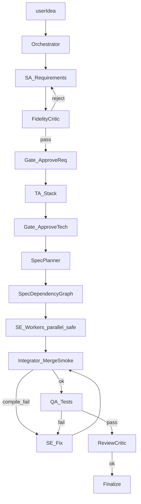

# ADR: fluxo multiagente ideal (zTeam)

**Status:** Partially implemented — critics/gates/verify shipped; SE parallel + `dependsOn` still future  
**Date:** 2026-09-24 (updated 2026-09-25)  
**Context:** [workflow-pacman-z2.md](./postmortems/workflow-pacman-z2.md) §8 — pipe linear frágil em greenfield. Plans: [postmortems/](./postmortems/).

## Decisão

Evoluir o orquestrador de uma cadeia SA→TA→SE→QA para um sistema com **critics, gates, grafo de specs (`dependsOn`), integrator e checkpoints**.

**Já entregue (2026-09-25):** deterministic `verifyDelivery`, fidelity hard FAIL, delivery critics (architecture + delivery), scaffold augment, HITL `approve_gate` (when `ZTEAM_HITL=1`), resume phantom reopen, classified `failureKind`s.

**Ainda futuro:** SE paralelo seguro, `dependsOn` waves, integrator merge dedicado, gate HITL obrigatório em todo full.

## Fluxo-alvo



## Já no pipe atual

| Ideal | Aproximação atual |
|-------|-------------------|
| FidelityCritic | `fidelityCriticRequirements` — **FAIL hard** + redo SA (não só append Constraints) |
| Architecture / delivery critic | `deliveryCriticArchitecture`, `deliveryCriticDelivery` |
| Integrator / smoke antes de done | `verifyDelivery` + `tsc --noEmit` antes de `markTodoDone`; anti-batch-fake |
| QaReport / FILE opcional | QA aceita `===SUMMARY===` |
| checkpoint / resume | `workflow=resume` + phantom `[x]` reopen + `.docs/pipeline-result.json` |
| path hygiene | `sanitizeFilePath` / `sanitizeFileBody` + workspace write guard |
| HITL gates | MCP `approve_gate` when `ZTEAM_HITL=1` |
| Empty LLM | `failureKind=llm_empty` — sem stub charter / implement-core |

## Schema — `.docs/pipeline-state.json`

Já existe writer via `pipeline-state.ts` / progress packs. Forma canônica continua evoluindo; ver também `.docs/architecture-progress.json` e `.docs/implementation-progress.json`.

## Schema — `dependsOn` no todo (futuro)

```markdown
- [ ] project-setup: Scaffold
- [ ] maze-system: Maze (dependsOn: project-setup, types-constants)
- [ ] entities: Ghosts (dependsOn: maze-system, state)
```

Parser sugerido: trailing `(dependsOn: slug, slug)`.

Paralelismo só quando **não** há overlap de paths nos specs da mesma wave.

## Papéis (resumo)

| Papel | Faz | Não faz |
|-------|-----|---------|
| Orchestrator | rota, budgets, `verifyDelivery`, checkpoints | código de produto |
| FidelityCritic | pass/reject vs userIdea | reescrever tudo |
| SpecPlanner | todo + specs (+ dependsOn futuro) | implementar |
| SE Worker | batch specs + context pack | “melhorar” fora do escopo |
| Delivery critic | reopen gaps | escrever código |
| QA | testes + classificador bootstrap/logic | refatorar features |

## Anti-padrões

- Todo `[x]` sem Files to touch / smoke
- Paralelismo com overlap de arquivos
- Punch/fix reabrindo SA/TA sem necessidade
- Copiar projeto irmão sem registrar bypass
- Aceitar LLM vazio como sucesso (stub)

## Próximos passos de implementação

1. Parser `dependsOn` + waves seriais
2. Nó Integrator explícito entre SE wave e QA (além do verify inline)
3. HITL interrupt LangGraph em gates req/tech (hoje `approve_gate` + pause opcional)
4. SE paralelo só em waves sem overlap de paths
