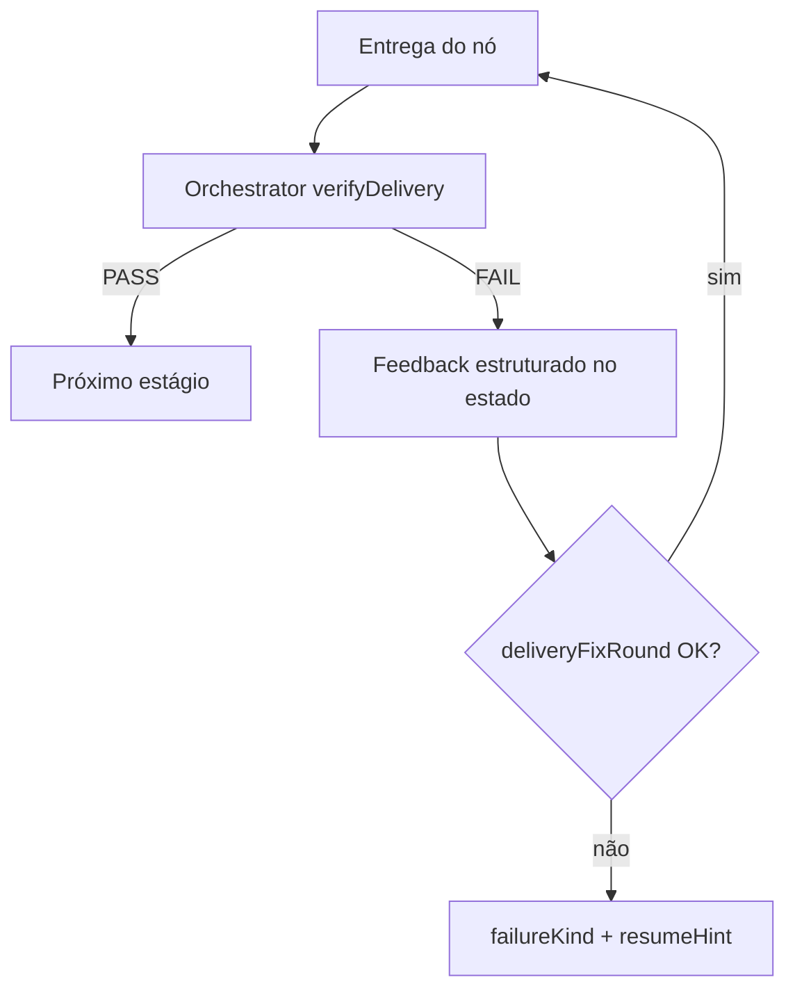
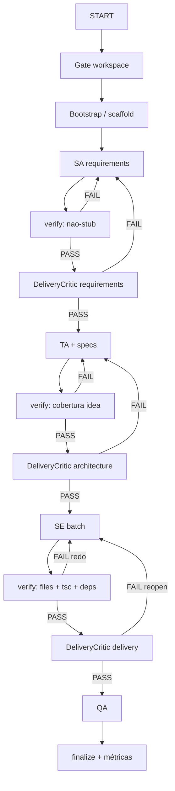

# Plano de melhoria zTeam — qualidade de entrega e verify do orquestrador

> **Status: implemented (2026-09-25)** — verifyDelivery, delivery critics, fidelity hard FAIL, and related gates shipped. Archived.

**Base (external session note, not in this repo):** `zz-zteamwork-review.md` (sessão MyPokeCards 2026-09-24)  
**Complementa:** [3-zteam-improvements.md](./3-zteam-improvements.md) (bootstrap, vitest, progressToken, etc.)  
**Princípio:** o orquestrador **avalia cada entrega e pede redo** se quebrou o caminho — sem um agente LLM em todos os nós.

---

## 1. Diagnóstico (o que o review mostrou)

O `full`/`resume` no MyPokeCards falhou principalmente por:

1. **Workspace sticky** (`WORKSPACE_ROOT` → outro repo)
2. **Specs marcadas `[x]` sem código** (1 arquivo para N specs)
3. **LLM vazio / OUT=0 tratado como sucesso** + charter stub
4. **`tsc` aborta** sem loop de redo com feedback útil
5. Drift de produto (pedido TCGdex → docs pokemontcg.io)
6. Atritos MCP (stdout vs JSON-RPC, `needsConfig`/BOM no resume)

Conclusão: falta **Definition of Done + verify no grafo**, não “mais um writer”. O fidelity atual é fraco (warn); o smoke `tsc` detecta, mas **não recupera**.

---

## 2. Estratégia escolhida: pirâmide + verify do orquestrador

### 2.1 Pirâmide de qualidade

```text
        ┌──────────────────────────┐
        │  LLM Judge (raro)        │  UX / ambiguidade — só com build verde
        ├──────────────────────────┤
        │  Delivery Critic (fase)  │  3–4 pontos: reqs, TA+specs, batch SE, finalize
        ├──────────────────────────┤
        │  Gates + verify (código)   │  SEMPRE após cada entrega — pass/fail sem LLM
        └──────────────────────────┘
```

**Regra:** o que dá para validar com código não vai para LLM.

| Camada | Responsável | Exemplos |
|--------|-------------|----------|
| Gate / verify | **Orchestrator** | OUT=0, `===FILE===`, files da spec, `tsc`, workspace, N specs ≠ 1 file |
| Critic de fase | 1 papel LLM (opcional/evolução do fidelity) | API/locale vs `userIdea`; specs faltando |
| Judge | LLM raro | Qualidade UX subjetiva |

### 2.2 Por que *não* um agente de qualidade em todos os passos

- Multiplica custo/latência e falhas (critic também pode vir vazio)
- Os P0 do MyPokeCards são **determinísticos**
- Critic em todo micro-passo vira segundo writer frágil

### 2.3 Sim: o próprio orquestrador avalia cada entrega

Padrão **deliver → verify → redo**:

```text
Nó entrega (SA / TA / SE / scaffold)
    → orchestrator.verifyDelivery(...)
         PASS → avança (markTodoDone se aplicável)
         FAIL → injeta feedback + reabre estágio/slug (budget de retries)
```

Granularidade recomendada: **por batch SE / por spec / por fase de docs** — não por arquivo isolado.



---

## 3. Contrato de `verifyDelivery`

### 3.1 API conceitual

```ts
verifyDelivery({
  stage: "softwareEngineer" | "systemArchitect" | "technologyArchitect" | "scaffold",
  slugs?: string[],           // specs do batch
  filesWritten: string[],
  userIdea: string,
  appRoot: string,
}): {
  ok: boolean;
  reasons: string[];
  missingFiles: string[];
  reopenSlugs: string[];
  failureKind?: "llm_empty" | "spec_incomplete" | "tsc" | "bootstrap" | "fidelity";
}
```

### 3.2 Regras mínimas (sem LLM)

| Regra | Ação se falhar |
|-------|----------------|
| Body vazio / OUT=0 / sem marcadores de contrato | `llm_empty` — não gravar stub silencioso |
| SE: parse “Files to touch” da `.spec.md`; arquivos ausentes | `spec_incomplete` — **não** `markTodoDone` |
| Batch com N slugs e só 1 arquivo escrito (heurística) | FAIL — exigir cobertura mínima |
| `package.json` mudou → `npm install` se necessário; depois `tsc --noEmit` | `bootstrap` / `tsc` |
| `appRoot` fora do workspace esperado | Abortar antes do graph |

### 3.3 Feedback para redo (obrigatório)

O próximo prompt do SE/SA deve receber o diagnóstico, não só um throw:

```text
VERIFY FAIL for api-client, card-search:
- missing: src/api/types.ts, src/api/cards.ts, src/pages/Search.tsx
- tsc: (se houver)
Do NOT mark todos done. Emit ONLY the missing files as ===FILE:=== sections.
```

Espelhar budget já usado em QA: `deliveryFixRound` (máx. 2–3 por slug/batch).

### 3.4 Comportamento desejado (antes → depois)

| Situação | Hoje | Depois |
|----------|------|--------|
| 3 specs, 1 `package.json` | `[x]` nos três | FAIL + redo; nenhum `[x]` |
| LLM OUT=0 | “succeeded” + stub | `llm_empty` + fallback modelo ou abort classificado |
| `tsc` falha | abort pipeline | redo SE com log até budget; senão `resumeHint` limpo |
| Resume com `[x]` fantasma | ignora specs | scan: `[x]` sem files → reabrir automaticamente |
| TCGdex no pedido, outra API no TA | segue | critic/heurística FAIL antes do SE |

---

## 4. Delivery Critic (fase — não em todo nó)

Evoluir `fidelityCriticRequirements` (hoje sobretudo warn) para **FAIL hard** e 3–4 pontos no grafo.

| Ponto | Input | Critério |
|-------|--------|----------|
| Pós-requirements | `userIdea` + `requirements.md` | Não stub; keywords (API, locale, features) cobertas |
| Pós-TA + specs | idea + `technologies.md` + lista `.spec.md` | API/locale alinhados; features pedidas têm spec |
| Pós-batch SE (após gate PASS) | idea + files + DoD | Entrega cobre os slugs; senão reopen |
| Pré-finalize | build/test + checklist | Features obrigatórias presentes |

Contrato LLM do critic: `===VERDICT=== PASS|FAIL` + bullets.  
**Só roda se o gate determinístico passou** (não criticar lixo).

Papel: *reject / reabrir* — **não** escrever código (não é segundo SE).

---

## 5. Backlog priorizado

Esforço: **S** pequeno · **M** médio · **L** grande.

### Sprint A — Gates + verify no orquestrador (maior ROI)

| ID | Item | Onde | Aceite |
|----|------|------|--------|
| A1 | Reject empty / OUT=0 / sem contrato; `failureKind=llm_empty` | LLM wrapper / SE / SA | Zero charter stub silencioso em greenfield |
| A2 | DoD por spec: parse Files to touch; só `markTodoDone` se files + `tsc` OK | `markTodoDone` / SE | `api-client` `[x]` ⇒ `src/api/*` existe |
| A3 | Proibir N specs done com 1 file (heurística + reopen) | SE batch | Batch MyPokeCards-like não marca 3× |
| A4 | Loop deliver→verify→redo com `deliveryFixRound` + feedback no prompt | grafo SE | `tsc`/missing files → até 3 redos, não abort seco na 1ª |
| A5 | Workspace dinâmico / anti-sticky; log `appRoot` no start | MCP / resolveAppRoot | Nenhum write em repo errado |
| A6 | Logs só stderr; progressToken amarrado à tool call | MCP server | Zero JSON parse error por `[pipeline]` no stdout |
| A7 | `needsConfig`: não bloquear resume se env já tem modelos; JSON UTF-8 sem BOM | config gate | Resume pós-`full` sem fricção |

### Sprint B — Critic de fase + fidelidade

| ID | Item | Onde | Aceite |
|----|------|------|--------|
| B1 | Fidelity/requirements: FAIL hard se stub ou keywords críticas ausentes | `fidelityCritic*` | “TCGdex” no idea ⇒ não passa TA com API outra |
| B2 | Critic pós-TA+specs (lista de gaps) | novo nó ou extensão | Specs para collection/favorites se pedidas |
| B3 | Critic pós-batch SE (opcional se A2–A4 fortes) | grafo | Reopen slugs incompletos |
| B4 | Pré-finalize checklist vs `userIdea` | finalize | Pipeline não “ok” com Hello + docs genéricos |

### Sprint C — Recuperação, scaffold e métricas

| ID | Item | Onde | Aceite |
|----|------|------|--------|
| C1 | Resume reabre `[x]` sem arquivos da spec | `resumePrepare` | Fantasmas voltam a `[ ]` |
| C2 | Scaffold checklist (vite, tailwind, entry, router); augment se `package.json` existe | scaffold | Skip cego → augment |
| C3 | Classificar falhas: `bootstrap` \| `llm_empty` \| `spec_incomplete` \| `tsc` \| `qa` \| `fidelity` | pipeline-result | Operador sabe o próximo passo |
| C4 | Métricas: retries, OUT=0, specs marked without files | `pipeline-result.json` | Relatório sem grep manual |
| C5 | Fallback 9router real sob empty/latência | combo 9router | `Trying model 2/N` em caos |

**Alinhamento:** A5–A6 e bootstrap/vitest continuam cobertos também por `3-zteam-improvements.md` (P0/P1). Este plano **prioriza DoD + verify loop + fidelity hard**, que o review MyPokeCards evidenciou como P0 de produto.

---

## 6. Fluxo alvo (full)



---

## 7. Testes de regressão do harness

1. **Fixture:** SE “completa” 2 specs escrevendo 1 file → verify FAIL; todos continuam `[ ]`.
2. **Mock LLM OUT=0** → `llm_empty`; sem fallback stub de requirements.
3. **Spec com Files to touch** → markTodoDone só com paths presentes + `tsc` 0.
4. **Workspace errado** → recusa write antes do SE.
5. **userIdea com API nomeada** → critic/heurística FAIL se `technologies.md` divergir.
6. **Resume** com `[x]` fantasma → reabre automaticamente.

---

## 8. Fora de escopo (neste plano)

- Trocar modelo free só por performance (só após Sprint A; empty/OUT=0 primeiro).
- Reescrever LangGraph do zero.
- Critic LLM em **cada** arquivo ou cada pré-req individual.
- Alterar o app MyPokeCards (já recuperado fora do pipeline).

---

## 9. Riscos

| Risco | Mitigação |
|-------|-----------|
| Verify rígido demais (loop infinito) | `deliveryFixRound` + fail classificado |
| Parse frágil de “Files to touch” | Convenção fixa nas specs SA; fallback: pelo menos 1 path `src/` por spec de feature |
| Critic LLM flaky | Gates primeiro; critic só após PASS; timeout + FAIL = reopen docs, não inventar |
| Mais latência no `full` | Redos só em FAIL; critic em 3–4 pontos, não por file |

---

## 10. Ordem de implementação sugerida

```text
Sprint A:  A1 empty-reject → A2 DoD files → A3 anti-batch-fake → A4 verify loop
           → A5 workspace → A6 MCP stderr/token → A7 needsConfig
Sprint B:  B1 fidelity hard → B2 critic TA/specs → B3/B4 conforme necessidade
Sprint C:  C1 resume phantoms → C2 scaffold checklist → C3/C4 metrics → C5 fallback modelo
```

**Definição de pronto do plano:** um greenfield no estilo MyPokeCards não marca specs fantasma, não aceita LLM vazio como sucesso, e ou **termina com app verificável** ou falha com `failureKind` + `resumeHint` acionáveis — sem Hello + `[x]` mentirosos.

---

## 11. Referências

- `zz-zteamwork-review.md` (external) — problemas observados na sessão
- [3-zteam-improvements.md](./3-zteam-improvements.md) — P0 bootstrap/vitest/PATH, P1 FILE/progress/healthcheck
- Orchestrator: `verifyDelivery`, `fidelityCriticRequirements`, delivery critics, `tsc` smoke pré-`markTodoDone`, `MAX_DELIVERY_FIX_ROUNDS` / `MAX_QA_FIX_ROUNDS`
