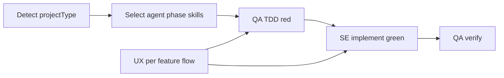

# Plano de melhorias zTeam — review Pacman-Z (pipeline + qualidade)

> **Status: open / backlog ativo** (2026-09-26) — documento de produto; **ainda não implementado** no orquestrador.

**Fonte:** [`zteam-pipeline-review.md`](../../zteam-pipeline-review.md) (tentativa full em `c:\GIT\ZAPFCOORP\pacman-z`, modelos `inherit`, runtime cursor + 7 stages Task).  
**Complementa (arquivados):** [3-zteam-improvements.md](./3-zteam-improvements.md), [5-zteam-improvement-plan.md](./5-zteam-improvement-plan.md), [6-zz-review-hygiene.md](./6-zz-review-hygiene.md).

**Princípio:** `ok: true` + suite verde **não** equivalem a Definition of Done. O Pacman-Z fechou 36/36 testes e ainda assim entregou fluxo Title→Play quebrado (overlays `PAUSED` + `Generating maze…` simultâneos) — **falso verde** face a DoD de `screens-flow`.

---

## 0. Resumo do diagnóstico

| Camada | Causa-raiz dominante |
|--------|----------------------|
| Orquestração / MCP | Surface `user-zteam` desalinhado da skill/README (tools de config ausentes; schema incompleto; texto anti-Task vs playbook cursor) |
| Produto / qualidade | SE implementou CSS/`[hidden]` incorreto; QA não cobriu screen-flow; SA/UX/TA deixaram DoD testável fraco |
| Processo | Ordem atual `SE → QA` descobre gaps **depois** da implementação; UI/UX não é dono explícito do fluxo por funcionalidade; não há tipagem de projeto nem skills focadas por tipo |
| Modularidade | Orquestrador quase só oferece o pipeline monolítico; faltam fatias oficiais: config, skill, `.docs`, **uma feature**, **só testes**, **só docs/specs**, **análise por agente** |

ROI em seis frentes: (1) alinhar MCP/skill/config, (2) **capacidades isoladas** (setup + fatias de trabalho), (3) **TDD**, (4) **UI/UX dono de fluxos**, (5) **tipo de projeto + skills por agente/fase**, (6) **Skills/config por host LLM** (Cursor → Copilot → OpenCode).



---

## 1. Melhorias derivadas do review (acionáveis)

Cada item: ID · severidade · onde · critério de aceite. Referências § do review entre parênteses.

### 1.1 MCP surface e schema

| ID | Sev. | Melhoria | Onde | Critério de aceite |
|----|------|----------|------|--------------------|
| R-MCP-01 | Alta | Re-expor `get_zteam_config` / `write_zteam_config` **ou** atualizar skill/README/regra Cursor para o surface real (só `run_development_pipeline` + `mcp_auth`) | MCP server + [`.cursor/skills/zteam/SKILL.md`](../../.cursor/skills/zteam/SKILL.md) + [`.zteam/README.MD`](../../.zteam/README.MD) | Agent consegue gate canônico sem improvisar `.zteam/config.json` de outro repo (§1.1, §2.1) |
| R-MCP-02 | Média | Publicar no `inputSchema` os campos que o servidor valida: `workspaceRoot` (obrigatório), `workflow`, `slug` / `scope`, etc. | Tool descriptor `run_development_pipeline` | GetDynamicTools lista os mesmos campos que a validação exige; zero `-32602` em primeira chamada “pela skill” (§1.2) |
| R-MCP-03 | Média | Atualizar description da tool: dual runtime (cursor Task vs 9router LangGraph); remover/condicionar “Do not use Cursor Task” quando `delegated === true` | MCP description + skill | Description e playbook não se contradizem (§1.4, §3.4) |
| R-MCP-04 | Média | Alinhar `docsOnly` vs `workflow` (`full` \| `docs` \| `feature` \| `punch` \| `fix` \| `resume` \| fatias §2) no schema publicado | Schema + docs | Modes da skill mapeados e documentados no schema (§3.5) |

### 1.2 Runtime, config e defaults

| ID | Sev. | Melhoria | Onde | Critério de aceite |
|----|------|----------|------|--------------------|
| R-CFG-01 | Alta | Template oficial de `.zteam/config.json` com **todos** os primaries atuais: SA, TA, **uiUxDesigner**, SE, QA (+ fallbacks / maxTokens) | Bootstrap / `@zteam/config` / exemplos README | Copiar template nunca omite UX (§1.3, §3.2) |
| R-CFG-02 | Alta | Papel novo ausente no config: **não** injetar default 9router silenciosamente se o resto é `inherit` — falhar `needsConfig` / `missing_role` **ou** herdar a mesma família do config existente | Resolução de models | Impossível obter `mixed_runtime` só por primary UX omitido (§1.3, §3.2) |
| R-CFG-03 | Média | Em `mixed_runtime` / missing role: `resumeHint` com **snippet de config sugerido** (primaries homogeneizados) | Erro MCP | Agent corrige em um passo (§5 médio prazo) |
| R-CFG-04 | Baixa–média | Preferir `workspaceRoot` explícito; não confiar em `WORKSPACE_ROOT` sticky | MCP + skill | Artefactos sempre no `appRoot` do workspace Cursor (§3.3) |

### 1.3 Documentação e skill

| ID | Sev. | Melhoria | Onde | Critério de aceite |
|----|------|----------|------|--------------------|
| R-DOC-01 | Média | Exemplos e `@zteam/models` listam **uiUxDesigner** como primary obrigatório | Skill, `.zteam/README.MD`, regras Cursor | Docs = runtime (§1.3, §2.3) |
| R-DOC-02 | Média | Checklist pós-run: config homogênea; se cursor, playbook stage a stage; artefactos no `appRoot`; testes/build | Skill / README | Repete §5 verificação do review |
| R-DOC-03 | Baixa | Não bootstrapar README/skill de projeto irmão sem diff de roles | Processo / bootstrap | Evita config incompleta tipo mypokecards → pacman-z (§2.3) |

### 1.4 Gates de qualidade (falso verde / screen-flow)

| ID | Sev. | Melhoria | Onde | Critério de aceite |
|----|------|----------|------|--------------------|
| R-QA-01 | Crítica | QA **não** pode fechar stage se existe spec marcada `[x]` (ex. `screens-flow`) sem testes que cubram seus ACs (incl. DOM/overlays quando aplicável) | Playbook / `qaEngineer` / verify | Caso Pacman-Z §8: suite sem `PlayScreen` / router / busy-pause = FAIL de pipeline |
| R-SE-01 | Crítica | SE **não** marca `[x]` em specs de fluxo de tela sem checklist mínimo (ex.: Title→Play limpo; Esc pause; Resume; busy cleared) | SE + `verifyDelivery` / DoD | `screens-flow` não fecha só com “hook exists” (§8.3–8.4) |
| R-SPEC-01 | Alta | Endurecer DoD de screen-flow: no máximo um overlay modal visível; busy never stuck após maze/validação; exclusão mútua loading ⊥ pause ⊥ playing | SA specs + UX enrich | Contrato testável; DoD “hook exists” proibido como suficiente (§8.2–8.4) |
| R-SPEC-02 | Média | Testes de transição SF-1…SF-N **bloqueantes** no backlog (não “light”) | SA todo + specs | Todo lista testes de fluxo como critério de done |
| R-TA-01 | Média | TA fixa padrão DOM seguro: não combinar `display: flex` fixo com toggle só via `[hidden]`; ou state machine de chrome (`'play' \| 'play-paused' \| …`) | `technologies.md` / enrich TA | Spec TA impede a causa CSS do §8.2 |
| R-PB-01 | Média | Playbook cursor: papel UX com subagent dedicado (não `generalPurpose`); path absoluto `appRoot` reforçado uma vez | Delegation playbook | Menos fricção §2.2 |
| R-PB-02 | Baixa | Reduzir repetição da `userIdea` inteira em cada stage (resumo + ponteiros a artefactos) | Playbook prompts | Menos ruído/custo de contexto (§2.2) |

### 1.5 Gaps de produto observados (secundários)

| ID | Sev. | Melhoria | Nota |
|----|------|----------|------|
| R-PROD-01 | Baixa–média | Cobertura de property tests / seeds; playtest de AI/túnel | Relatados por SE/QA no Pacman-Z; não bloquearam “ok” — com TDD + tipo `webgame` passam a gates tipados (§2.4) |
| R-PROD-02 | Fora de escopo zteam | Naming próximo a marca (Pacman-Z) | Decisão de produto do app; monitorar em distribuição pública (§3.6) |

---

## 2. Capacidades isoladas do orquestrador

### 2.1 Problema

Hoje o caminho natural empurra para `run_development_pipeline` (full ou docs). No Pacman-Z, sem `get_zteam_config` / `write_zteam_config`, o agent **improvisou** bootstrap: criou config à mão, copiou skill/README de outro repo (§1.1, §2.1, §2.3).

A skill já descreve subcomandos (`@zteam/config`, `@zteam/models`, `@zteam/documentation`, `@zteam/tests`), e existem workflows `feature` / `docs` / `punch`, mas o **orquestrador MCP** não expõe um catálogo claro de fatias com parâmetros (`slug`, `role`, `scope`) e allowlists de write. Resultado: “usar zteam” = quase sempre pipeline inteiro, ou trabalho manual fora do contrato.

### 2.2 Família A — setup / harness (sem time de produto)

Executar **sem** disparar SA→TA→SE→QA de feature:

| Capacidade isolada | O que cobre | Gatilho / superfície desejada |
|--------------------|-------------|-------------------------------|
| **Configurar o projeto** | Só setup: models, maxTokens, scope, gitignore, `projectType`, primaries (incl. UX) | `@zteam/config` + tools MCP `get_zteam_config` / `write_zteam_config` |
| **Config geral zteam** | Ler/escrever `.zteam/config.json`; validar runtime homogéneo; sugerir defaults / snippet em erro | Tools de config + healthcheck de models **sem** pipeline |
| **Skill de uso do zteam** | Instalar/atualizar a skill canónica (`.zteam/skills/SKILL.md`); **não** copiar de projeto irmão | `ensure_zteam_skill` / stage `bootstrap-skill` |
| **Pasta `.docs` (bootstrap)** | Criar/normalizar árvore `.docs/` vazia ou stub **sem** conteúdo de produto gerado por LLM | Bootstrap de pastas + placeholders |

### 2.3 Família B — fatias de trabalho do time

Estas **usam** agentes, mas com escopo delimitado (não greenfield full de N specs):

| Capacidade | O que cobre | Time / papéis | Superfície desejada |
|------------|-------------|---------------|---------------------|
| **Uma feature (spec única)** | Desenvolver **uma** funcionalidade de ponta a ponta como se fosse **uma única spec**: cada papel analisa só a sua parte (SA escopo/AC, UX fluxo, TA encaixe técnico, QA-red, SE-green, QA-verify) | Time **inteiro**, escopo = 1 slug / 1 requisito | `workflow: "feature"` + `slug` **obrigatório**; ou `@zteam/feature <slug\|idea>` |
| **Só docs e specs** | Requirements / technologies / todo / specs / ui-ux — **sem** SE nem QA de implementação | SA + UX + TA (pipeline docs) | `workflow: "docs"` / `@zteam/documentation` — endurecer: zero writes em `src/**` / tests |
| **Só testes de um requisito** | Gerar (TDD-red) ou reforçar testes **apenas** para um requisito/spec — **sem** implementar produto | QA (opcional: SA aponta ACs) | `@zteam/tests` + `slug` / `requirementId`; writes só em `**/*.{test,spec}.*` |
| **Análise (review) por fatia** | Analisar parte do projeto **sem** implementar: todo o time em modo crítico **ou** **um único agente** | Ver §2.4 | `@zteam/analyze` + `scope` + opcional `role` |

Relação com workflows atuais em [`src/workflows/types.ts`](../../src/workflows/types.ts): `docs` e `feature` existem no router, mas faltam **parâmetro de slug**, modo **tests-only**, e modo **analyze** (read-mostly) explícitos no MCP/skill.

### 2.4 Análise isolada — todo o time ou um agente

| Modo | Papéis | Entrada | Saída típica | Não faz |
|------|--------|---------|--------------|---------|
| **Analyze-all** | SA + TA + UX + SE + QA (cada um a sua lente) | `scope` = pasta, spec, requisito, ou “todo.md item” | Relatório em `.docs/reviews/<scope>-review.md` (ou stdout estruturado): gaps, riscos, DoD fraco | Não marca `[x]`; não escreve código de produto |
| **Analyze-role** | **Um** agente (`systemArchitect` \| `technologyArchitect` \| `uiUxDesigner` \| `softwareEngineer` \| `qaEngineer`) | `scope` + `role` | Parecer focado (ex.: só UX em `screens-flow`; só QA na cobertura de testes) | Não invoca os outros papéis; não implementa |

Exemplos de pedido:

- “Analisa só o fluxo de telas com o UX.”
- “QA: analisa se os testes cobrem `screens-flow`.”
- “Time inteiro: analisa o item `maze-generation` do todo.”

### 2.5 Feature única — contrato do time na mesma spec

Quando o utilizador pede **apenas uma feature**:

```text
slug (ou idea → SA cria 1 spec)
  → SA: AC / use cases daquela spec (ou reusa existente)
  → UX: ## Flow & states só daquela feature
  → TA: encaixe técnico / files to touch
  → QA-red: testes daquela spec
  → SE-green: implementação até verde
  → QA-verify
  → (opcional) SA summary curto da feature
```

Critérios:

1. **Um** slug no todo aberto (ou criado); outros `[ ]` intocados.
2. Cada agente recebe contexto **só** dessa spec + artefactos globais necessários (technologies, ui-ux), não o backlog inteiro.
3. TDD da §3 aplica-se dentro da feature.
4. Finalize não declara o produto “completo” se outras specs ficam abertas — status = feature X done.

### 2.6 Contrato de isolamento (writes)

1. **Sem side-effects indevidos:** “só config” / “só skill” / “só analyze” **nunca** marcam todos `[x]` nem correm SE full.
2. **Allowlist por capacidade:**

| Capacidade | Pode escrever | Não pode escrever |
|------------|---------------|-------------------|
| Config / geral | `.zteam/config.json`, gitignore zteam | `src/**`, `.docs/specs/**` |
| Skill de uso | `.zteam/skills/**` (template do pacote) | Código de app; models (salvo defaults) |
| Docs + specs | `.docs/**`, README status | `src/**`, testes de produto |
| Só testes (1 requisito) | Ficheiros de teste do slug | Implementação de produto; outras specs |
| Uma feature | Spec/todo daquele slug + código/testes **do** slug | Outros slugs; wipe de `.docs` |
| Analyze | `.docs/reviews/**` (ou só retorno MCP) | Código; marcar `[x]` |

3. **Idempotente e auditável:** cada capacidade devolve `ok`, `capability`, paths tocados, `rolesRun`, `nextHint`.
4. **Skill = MCP:** subcomandos e params (`workflow`, `slug`, `role`, `scope`) alinhados — zero drift (§3.1 do review).

### 2.7 Critérios de aceite

1. **Só configurar** o projeto e parar — sem `run_development_pipeline` full.
2. **Só** garantir skill + README zteam a partir do template do pacote.
3. **Só docs e specs** (`workflow: "docs"`) sem SE/QA de código.
4. **Só testes** de um requisito/slug (`@zteam/tests` + `slug`).
5. **Uma feature** com time completo e escopo = 1 spec; outros todos intactos.
6. **Analyze-all** e **analyze-role** produzem parecer sem implementar.
7. Pacman-Z §1.1: `needsConfig` → config; skill em falta → skill; sem improvisar de outro repo.
8. Documentação lista matriz: capacidade → tool/subcommand → params → paths → papéis.

### 2.8 Relação com outros itens

- **R-MCP-01 / R-MCP-04:** tools + `workflow` / `slug` / `role` / `scope` no schema.
- **§3 TDD:** feature única e “só testes” usam red→green (green só se houver fase SE).
- **§4 UX flow:** na feature única, UX obrigatório se `needsUiFlow`.
- **§5 `projectType`:** gravado na capacidade **config**.
- **§6 skills de papel:** distintas da **skill de uso do zteam** (§2.2).

---

## 3. TDD — testes primeiro, código depois

### 3.1 Problema

Fluxos atuais em [`src/workflows/types.ts`](../../src/workflows/types.ts):

```text
… → scaffold → SE* → QA* → …
```

O QA entra **depois** da implementação. No Pacman-Z, o QA reforçou o que o SE já destacou (maze/ranking) e **omitiu** screen-flow pedido na spec — suite verde = falso sinal de pronto.

### 3.2 Ordem alvo

```text
… → scaffold → QA (red: testes a partir das specs) → SE (green: código até passar) → QA (verify + gaps / regressão) → …
```

Aplicar a `full`, `feature` (1 slug), `resume`. Em `punch` / `fix`: QA-red só para o escopo reaberto; depois SE; depois QA-verify. Em **só testes**: apenas QA-red (e opcionalmente verify se já houver código).

### 3.3 Responsabilidades

| Fase | Agente | Faz | Não faz |
|------|--------|-----|---------|
| **TDD-red** | QA | Escreve testes **falhando** alinhados a use cases, ACs, screen-flow, exclusão de estados | Não implementa produto; não marca spec `[x]` |
| **TDD-green** | SE | Implementa até os testes do batch passarem; Clean Code + self-check; `verifyDelivery` / `tsc` | Não reduz cobertura para “ficar verde” |
| **TDD-verify** | QA | Roda suite; adiciona gaps/regressão; tech debt de spec incompleta | Não é a **primeira** descoberta do DoD — isso foi o red |

### 3.4 Critérios de aceite (processo)

1. Para cada slug marcado para implementação, existem testes red **antes** do primeiro write SE desse slug.
2. `markTodoDone` / `[x]` só após green + verifyDelivery.
3. Specs de UI/fluxo **obrigam** testes DOM/router/overlay no red.
4. Falso verde Pacman-Z (§8) seria pipeline FAIL na fase red ou verify.

### 3.5 Impacto de implementação (futuro)

- Grafo / playbook: nó `qaTddRed` antes de `softwareEngineer`.
- [`src/role-prompts.ts`](../../src/role-prompts.ts): `qaEngineerTddRedPrompt` vs `qaEngineerVerifyPrompt`.
- `verifyDelivery` e métricas red→green→verify em `pipeline-result.json`.

---

## 4. UI/UX dono do fluxo por funcionalidade

### 4.1 Problema

Hoje UX cobre juice e look-and-feel (`.docs/ui-ux.md`) + enrich por slug. No Pacman-Z isso **não** exigiu matriz testável de exclusão de overlays — contrato fraco → escape (§8.3).

### 4.2 Ownership desejado

Para **cada** funcionalidade/spec com superfície humana, UI/UX é responsável por:

1. **Mapa de fluxo** — estados, telas, overlays, modais, loading, empty, error.
2. **Matriz de exclusão** — estados mutuamente exclusivos (ex.: `busy ⊥ paused ⊥ playing`).
3. **Transições** — gatilhos e feedback/juice por transição.
4. **Critérios testáveis** — linguagem que o QA-red vira assertiva.
5. **Alinhamento com TA** — state machine / padrão DOM seguro.

### 4.3 Pontos no grafo

| Momento | Artefacto / ação |
|---------|------------------|
| Pós-requirements (juice) | Reforçar fluxos críticos |
| Look-and-feel | `.docs/ui-ux.md` → secção **Flows & exclusive chrome** |
| Enrich por slug | `## Flow & states` obrigatória + ACs testáveis |
| Pré-SE / gate | Spec sem flow (quando `needsUiFlow`) → `spec_incomplete` |
| TDD-red / feature única | Testes de fluxo derivados desta secção |

### 4.4 Critério de aceite (produto)

O defeito §8 (PAUSED + Generating maze + gameplay) **seria barrado** por matriz UX + teste red de exclusivity + SE green.

### 4.5 Flag por tipo de projeto

`needsUiFlow` true para `webgame`, `webapp`, `mobile`, `frontend`, `fullstack` com UI; false/leve para `backend`, `library`, `cli-dos` sem TUI (ver §5).

---

## 5. Estratégia de tipo de projeto

### 5.1 Por quê

Scaffold, DoD, skills e rigor de UX/TDD diferem entre **webgame**, **CRUD** e **backend**. Sem tipagem, o pipeline aplica o mesmo molde.

### 5.2 Taxonomia inicial (extensível)

| `projectType` | Exemplos | Ênfases |
|---------------|----------|---------|
| `webgame` | Pacman-Z, canvas/DOM games | Screen-flow, input, loops, overlays, juice |
| `crud` | Admin, inventário | Forms, validação, list/detail, API |
| `webapp` | SaaS UI genérico | Navegação, auth UX, empty/error |
| `mobile` | App / PWA mobile-first | Nav stacks, gestos |
| `cli-dos` | CLI / TUI | Args, exit codes, stdout |
| `backend` | API / workers | Endpoints, schemas, authz |
| `frontend` | UI sem backend no escopo | Componentes, rotas |
| `fullstack` | App + API | Contratos FE↔BE, E2E mínimos |
| `library` | Pacote | API pública, testes de contrato |
| `desktop` | App desktop | Janelas, filesystem (leve no MVP) |
| `other` | Fora da lista | Perfil + gates custom |

### 5.3 Quando e onde definir

1. **Cedo:** capacidade **config** (§2.2) / `@zteam/config` / SA — `projectType` em `.zteam/config.json` e/ou `.docs/project-type.md`.
2. Heurística a partir de `userIdea` + confirmação humana.
3. Consumidores: TA, scaffold, UX (`needsUiFlow`), QA-red, skills (§6), fatias §2.3.

### 5.4 Gates por tipo (exemplos)

| Tipo | Gate mínimo além do genérico |
|------|------------------------------|
| `webgame` | Screen-flow + testes de chrome/overlay |
| `crud` | Matriz CRUD + form/API |
| `webapp` / `frontend` | Rotas + empty/error |
| `mobile` | Nav stack + loading |
| `backend` | Contratos de endpoint + falha/auth |
| `fullstack` | Um caminho FE→BE coberto |
| `cli-dos` | Help + exit codes |
| `library` | Export surface + testes de API |

---

## 6. Skills por agente × fase × tipo de projeto

### 6.1 Objetivo

Skills **bem definidas, focadas**, usadas em cada stage — não um monolito. Declaram: papel, fase, tipos aplicáveis, entradas, saídas, DoD, anti-padrões.

**Nota:** distintas da **skill de uso do zteam** (harness em §2.2).

### 6.2 Localização proposta

- `.zteam/skills/<agent>/<phase>/` ou por `projectType`
- Espelho Cursor opcional para `inherit`
- Runtime resolve `(role, phase, projectType)` e injeta no prompt ([`role-prompts.ts`](../../src/role-prompts.ts))

### 6.3 Fases canônicas

| Fase id | Agente | Notas |
|---------|--------|-------|
| `requirements` | SA | Pré-reqs / requirements |
| `juice` | UX | Score + addendum |
| `technologies` | TA | Stack + padrões |
| `look-and-feel` | UX | `ui-ux.md` + flows |
| `todo-plan` | SA | Todo |
| `spec-write` | SA | Spec por slug |
| `spec-flow` | UX | Enrich fluxo |
| `spec-tech` | TA | Enrich técnico |
| `tdd-red` | QA | Testes falhando |
| `implement` | SE | Green |
| `tdd-verify` | QA | Verify |
| `analyze` | Qualquer / todos | Modo review §2.4 |
| `summary` | SA | User report |

### 6.4 Exemplos de skills

| Skill | Foco |
|-------|------|
| `sa-requirements-webgame` | Loops, score, telas, input |
| `sa-requirements-crud` | Entidades, list/detail |
| `ux-flow-webgame` | Overlays / exclusão |
| `ux-flow-webapp` | Nav / forms |
| `ta-stack-webgame` | Game loop + chrome seguro |
| `ta-stack-backend` | Rotas / persistência |
| `qa-tdd-red-screenflow` | Red tests de overlays |
| `qa-tdd-red-api-contract` | Red tests de API |
| `se-implement-tdd-green` | Só o necessário para green |
| `qa-analyze-coverage` | Analyze-role QA |
| `*-analyze-*` | Parecer por papel sem implementar |

### 6.5 Matriz de resolução

```text
skillKey = resolve(role, phase, projectType)
  → try exact:  {role}-{phase}-{projectType}
  → else fall:  {role}-{phase}-core
```

### 6.6 Critérios de aceite (catálogo)

1. Cada skill ≤ 1 página: missão, checklist, anti-padrões, artefactos.
2. Piloto completo `webgame` + `crud`.
3. Playbook e grafo referenciam `skillKey` (incl. fatias §2).
4. Catálogo versionado com o pacote (anti-drift skill↔MCP).

---

## 7. Priorização sugerida (execução futura)

### P0 — Desbloqueia confiabilidade e DoD

| ID | Item | Origem |
|----|------|--------|
| P0-1 | R-MCP-01 / R-MCP-02 — surface + schema (`workflow`, `slug`, …) | Review §1 |
| P0-2 | **Capacidades isoladas setup** (§2.2) — config / skill / `.docs` bootstrap | Pedido + Review §1.1 |
| P0-3 | R-CFG-01 / R-CFG-02 — template + sem inject 9router | Review §1.3 |
| P0-4 | R-MCP-03 / R-DOC-01 — dual runtime + UX nos exemplos | Review §1.4 |
| P0-5 | **TDD reorder** (§3) | Pedido + §8 |
| P0-6 | R-QA-01 / R-SE-01 / R-SPEC-01 — anti falso verde | Review §8 |

### P1 — Fatias de trabalho + UX

| ID | Item | Origem |
|----|------|--------|
| P1-1 | **Uma feature** (§2.3 / §2.5) — time completo, 1 slug | Pedido |
| P1-2 | **Só docs/specs** endurecido (§2.3) | Pedido |
| P1-3 | **Só testes** de um requisito (§2.3) | Pedido |
| P1-4 | **Analyze-all / analyze-role** (§2.4) | Pedido |
| P1-5 | UI/UX ownership (§4) — `## Flow & states` | Pedido + §8.3 |
| P1-6 | R-TA-01 / R-PB-01 — DOM seguro + subagent UX | Review §8 / §2.2 |

### P2 — Tipagem e skills

| ID | Item | Origem |
|----|------|--------|
| P2-1 | Taxonomia + `projectType` (§5) | Pedido |
| P2-2 | Gates por tipo (§5.4) | Pedido |
| P2-3 | Catálogo skills agente×fase×tipo (§6) | Pedido |
| P2-4 | R-PB-02 — prompts enxutos | Review §2.2 |

### P3 — Hosts multi-LLM (Cursor → Copilot → OpenCode)

Preparar o **pacote zteam** para ser consumido por outras LLMs/IDEs: primeiro com riqueza máxima no **Cursor**, depois **GitHub Copilot**, depois **OpenCode**. Cada host precisa de Skills (e config) **diferenciadas** — não um único texto genérico.

| ID | Item | Foco |
|----|------|------|
| P3-1 | **Cursor (rico)** — Skills + rules + MCP wiring de referência; prévias de config (`get`/`write`/`ensure_zteam_setup`), dual-runtime, playbook Task, fatias §2 | Baseline canónico; mais completo |
| P3-2 | **GitHub Copilot** — Skills/instruções adaptadas (agent instructions / `.github` ou equivalente Copilot); config e prévias sem assumir Cursor Task/`GetDynamicTools`; como chamar MCP ou CLI `npm run pipeline` | Segundo host |
| P3-3 | **OpenCode** — Skills + config para OpenCode; mapear tools/CLI; prévias de setup e limites do host | Terceiro host |

### P4 — Higiene e documentação viva

| ID | Item | Foco |
|----|------|------|
| P4-1 | **Limpeza do repo** — analisar ficheiros; manter só o necessário ao MCP/orquestrador | Reduzir ruído e drift |
| P4-2 | **README alinhado ao workflow atual** — grafo, TDD, fatias, tools, dual-runtime | Única narrativa pública |

**Contrato comum (todas as P3-*):**

1. Skill de **uso** do zteam **por host** (paths, como descobrir tools, restart MCP/CLI).
2. Bloco de **configuração prévia** diferenciado: models, `projectType`, `workspaceRoot`/`cwd`, o que o host não tem (ex.: Copilot sem `delegationPlaybook` Cursor).
3. Melhorar informações prévias (bootstrap, `needsConfig`, allowlists) **sem** misturar instruções Cursor-only nos outros hosts.
4. Catálogo partilhado de conceitos (workflows, fatias) + **adapters** por LLM/IDE.

Ver também secção **§11** abaixo.

---

## 8. Checklist de verificação (quando implementado)

- [x] Config template com `uiUxDesigner`; sem `mixed_runtime` por omitir UX
- [x] Capacidades setup: só config / só skill / bootstrap `.docs` (`ensure_zteam_setup`)
- [x] Grafo/playbook: **QA-red antes de SE**
- [x] Specs UI com `## Flow & states` quando UI (prompt UX)
- [x] Workflows `tests` | `analyze` + params `slug`/`role`/`scope`
- [x] Skills piloto roles (webgame/crud/screenflow) sob `.zteam/skills/roles/`
- [x] README topo alinhado a TDD + tools + workflows
- [ ] Capacidade **uma feature** (1 slug) — param existe; endurecer filtro SE
- [ ] Allowlist writes por capacidade (docs-only sandbox) — parcial
- [ ] Skills/config **Copilot** / **OpenCode**
- [ ] Limpeza repo (G1)
- [ ] Regressão Pacman-Z §8: overlays em fixture de smoke dedicada

---

## 9. Fora de escopo deste documento

- Hotfix do CSS/`[hidden]` no app Pacman-Z.
- Capacidade do provider 9router / limites de tokens (postmortems anteriores).
- Implementar adapters Copilot/OpenCode **antes** do MCP Cursor estável (P0–P1) — P3 depende da surface estável.

---

## 10. Conclusão

O review mostrou falhas estruturais: **porta de entrada zteam** (MCP/skill/config em drift), **falta de capacidades isoladas** (setup e fatias de trabalho), e **qualidade de entrega** (código antes de testes de UI; UX sem ownership de fluxo; molde único por tipo de projeto).

A correção sustentável é: alinhar MCP; expor **partes isoladas**; **TDD**; **UI/UX** dono do fluxo; **tipo de projeto** + **skills focadas**; e depois **Skills/config por host LLM** (Cursor rico → Copilot → OpenCode). Só então “pipeline ok” volta a significar produto pronto — não suite verde oca.

---

## 11. Multi-host LLM — Skills e configuração por IDE

### 11.1 Objetivo

O orquestrador deve ser **usável por outras LLMs**, com onboarding e Skills **específicos** por ambiente:

| Ordem | Host | Riqueza esperada |
|-------|------|------------------|
| 1º | **Cursor** | Máxima: MCP tools, `@zteam`, rules, Task playbook, dual-runtime |
| 2º | **GitHub Copilot** | Alta: agent skills/instructions + CLI/MCP se disponível; sem depender de Task/`inherit` Cursor |
| 3º | **OpenCode** | Completa para o que o host oferece; mapear CLI `npm run pipeline` / MCP stdio |

### 11.2 O que diferenciar por LLM/host

| Dimensão | Cursor | Copilot | OpenCode |
|----------|--------|---------|----------|
| Descoberta de tools | GetDynamicTools / `user-zteam` | Catálogo MCP do Copilot ou só CLI | Config OpenCode + CLI |
| Runtime `inherit` | Playbook Task | Tipicamente **não** — forçar 9router ou CLI | Conforme suporte |
| Skill de uso | `.cursor/skills/zteam` + `.zteam/skills` | Skill/instructions Copilot (path canónico a definir) | Skill OpenCode (path canónico a definir) |
| Prévias de config | `get`/`write`/`ensure_zteam_setup` | Mesmos conceitos; passos sem UI Cursor | Idem |
| Exemplos | `@zteam/config`, Task stages | “Abre agent → cola skill → `npm run pipeline`” | Equivalente OpenCode |

### 11.3 Entregáveis (tarefas P3-1..3)

1. **P3-1 Cursor:** enriquecer skill/rules com matriz de capacidades §2, tools MCP completas, restart MCP, `uiUxDesigner` obrigatório, fatias feature/tests/analyze.
2. **P3-2 Copilot:** pacote de Skill + guia de config prévia (models, `projectRoot`, sem `delegationPlaybook`); testes manuais de smoke via CLI.
3. **P3-3 OpenCode:** idem para OpenCode; documentar limitações e caminho CLI-first.

Núcleo partilhado (não duplicar lógica): workflows, `projectType`, TDD, allowlists — só a **casca de host** muda.
