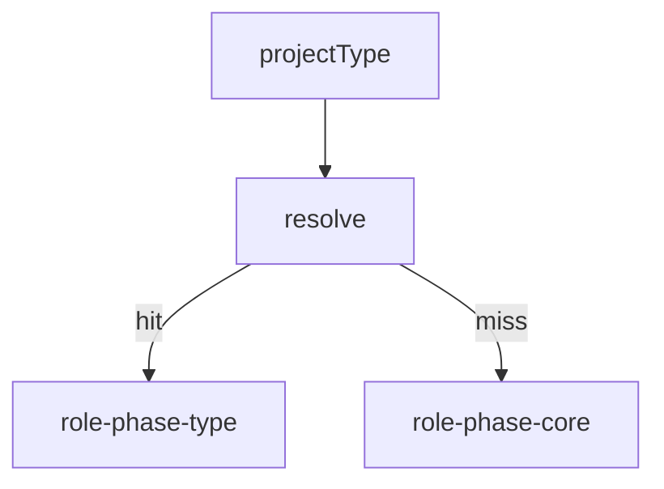

# Fase 9 — Catálogo de skills (role × fase × projectType)

> **Status: active** (2026-09-26) — inventário + stubs on-disk; **runtime injection ainda não ligado**.

**Backlog vivo:** [`.docs/todo-skills.md`](../todo-skills.md)  
**On disk:** [`.zteam/skills/roles/`](../../.zteam/skills/roles/)  
**Origem:** postmortem [8](./8-zteam-pipeline-review-improvements.md) §5–§6 + auditoria workflow TDD.

---

## 1. Objectivo

Skills **focadas** (≤1 página) por `(role, phase, projectType|qualifier)` para injectar no futuro em [`role-prompts.ts`](../../src/role-prompts.ts) / playbook Cursor — sem monolito.

Distintas da skill de **uso** zteam (`.cursor/skills/zteam`, `.zteam/skills/SKILL.md`).

---

## 2. Taxonomia

| Campo | Valores |
|-------|---------|
| Role | `sa` · `ta` · `ux` · `se` · `qa` |
| Phase | `bootstrap` · `requirements` · `juice` · `technologies` · `look-and-feel` · `todo-plan` · `spec-write` · `spec-flow` · `spec-tech` · `tdd-red` · `tdd-green` · `tdd-verify` · `fix` · `summary` · `tech-debt` · `analyze` · `delivery-critic` |
| projectType | `core` · `webgame` · `webapp` · `crud` · `backend` · `frontend` · `fullstack` · `mobile` · `cli-dos` · `library` · `desktop` · `other` |
| Qualifier | `screenflow` · `api-contract` · `forms` (quando span tipos) |

**Ficheiro:** `{role}-{phase}-{qualifier|projectType}.md`  
**Resolução:** exact → senão `{role}-{phase}-core`.

---

## 3. Critérios de aceite (fase 9)

1. [`.docs/todo-skills.md`](../todo-skills.md) lista **todas** as células de valor (on-disk + planned).
2. Stubs **core** + prioridade webgame/webapp/crud/backend existem em `.zteam/skills/roles/`.
3. Pilots existentes mantidos / referenciados (sem duplicar conteúdo útil).
4. Smoke verifica ficheiros `stub|pilot` on-disk.
5. **Não** exige wiring em `orchestrator.ts` nesta fase.

---

## 4. Fora de escopo (fase 9)

- `resolveSkillKey` + inject em LLM prompts
- Skills para nós heurísticos (`fidelityCritic`, `scaffoldPrepare`, …)
- Hosts Cursor ricos (F1) além do índice roles

---

## 5. Próximo (fase 9b / P2)

- Enrich stubs → `ready`
- Planned types: mobile, cli-dos, library, desktop, fullstack, frontend
- Runtime resolver + smoke de injecção
