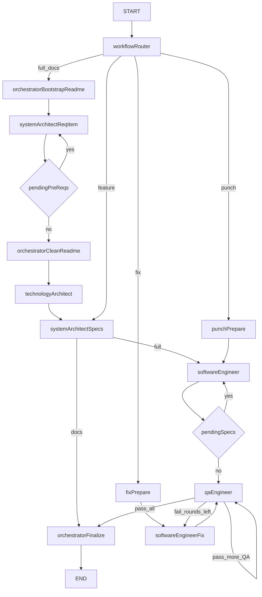
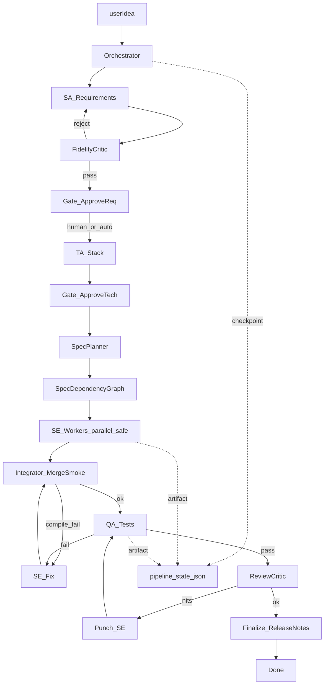

# Review — Pipeline zTeam na entrega Pac-Man z2

> Archived postmortem (2026-09-24). Sibling agents write-up: [agents-pacman-z2.md](./agents-pacman-z2.md).

**Data:** 2026-09-24  
**Workspace:** `C:\GIT\ZAPFCOORP\pacman-z2`  
**MCP:** `user-zteam` → `C:\Users\htzc\mcp-servers\dev-team-orchestrator`  
**Plano de melhorias (fonte histórica):** Cursor plan `zteam_mcp_improvements_22be0156` (may live under `~/.cursor/plans/`)  
**Postmortem irmão:** [agents-pacman-z2.md](./agents-pacman-z2.md)

**Pedido:** clone Pac-Man (TypeScript + Canvas), WASD, pellets, fantasmas, energizers, vidas infinitas + contador de mortes, teleporte, hooks de som documentados — via `@zteam`.  
**Resultado:** jogo jogável em `samples/pacman`, mas **não** como saída limpa e autônoma da pipeline. Docs/scaffold parciais vieram do zTeam; implementação/estabilidade exigiram recuperação manual e correção de corrupção gerada pelo próprio pipe.

---

## 1. Resumo executivo

O zTeam orquestra bem o *esqueleto* de um time (SA → TA → specs → SE → QA), mas nesta sessão mostrou-se **frágil em greenfield**:

1. Estoura o **limite de recursão** do LangGraph em `workflow=full`.
2. O **Software Engineer** aborta com `no_file_sections` em specs médias/grandes.
3. O **QA** falha por precondições (`Missing script: "test"`) ou pelo mesmo contrato rígido de `===FILE:===`.
4. Escritas de arquivo **não são sanitizadas** (fences Markdown, paths aninhados, prose `→ skipped`).
5. O **todo** marca itens `[x]` sem smoke — estado mentiroso após corrupção.
6. Não há **resume** de primeira classe: mid-failure empurra o agente Cursor a compensar o time.

**Veredito:** utilizável como gerador de docs/specs e pedaços de código sob supervisão; **ainda não confiável** como time multiagente autônomo para greenfield sem rede de segurança humana/Cursor.

**Correção de rumo:** higiene P0/P1 no orquestrador (plano) + evolução para o **fluxo multiagente ideal** (seção 8).

---

## 2. Fluxo atual do pipe

Incorporado do plano [`zteam_mcp_improvements_22be0156`](c:\Users\htzc\.cursor\plans\zteam_mcp_improvements_22be0156.plan.md).



**Em texto**

```text
START → workflowRouter
          ├─ full / docs → bootstrap → SA req* → TA → specs
          │                      ├─ docs → finalize
          │                      └─ full → SE* → QA*
          ├─ feature → specs → SE* → QA* → finalize
          ├─ punch   → prepare → SE → QA* → finalize
          └─ fix     → prepare → SE-fix → QA* → finalize
```

**Scripts npm** (`dev-team-orchestrator/package.json`):

| Script | Entrada |
|--------|---------|
| `pipeline` / `pipeline:docs` / `pipeline:full` | `scripts/run-pipeline.mjs` |
| `pipeline:feature` / `punch` / `fix` | `scripts/workflows/run.mjs` |
| MCP `run_development_pipeline` | `compiledGraph.invoke(...)` **sem** `recursionLimit` |

**Contrato LLM:** SE/QA emitem `===FILE: path===` + body → `assertHasFileSections` → `writeParsedFiles` → `writeDoc(appRoot, relPath)`.

| Config | Valor atual | Problema |
|--------|-------------|----------|
| `recursionLimit` | default LangGraph **25** | full com muitas specs estoura |
| Retries LLM | 3 | insuficiente sob overload / empty |
| `MAX_TOKENS_SOFTWARE_ENGINEER` | ~3500 | maze/entities não cabem |
| `MAX_QA_FIX_ROUNDS` | 3 | gasta rounds em Missing script test |
| `WORKSPACE_ROOT` | `pacman-z2` no mcp.json | OK aqui; histórico de cwd errado |
| `assertSafeAppRoot` | existe | não cobre nesting dentro do app |

---

## 3. Linha do tempo desta sessão

| # | Ação | Resultado | Impacto |
|---|------|-----------|---------|
| 1 | `workflow=full`, `projectRoot=samples/pacman` | **Recursion limit of 25** | Docs + specs + scaffold parcial |
| 2 | `workflow=feature` | SE: `no_file_sections` | Código não avança estável |
| 3 | `workflow=punch` (sound+state) | QA: `no_file_sections` | Artefatos inconsistentes |
| 4 | `workflow=punch` (sound) | QA: `Missing script: "test"` | Loop de fix inútil |
| 5 | FS | `samples/pacman/samples/pacman/...` | Path nesting |
| 6 | `workflow=fix` | `constants.ts` com fence + `→ skipped:` | Build quebrado |
| 7 | Correção manual + `tsc` | Jogo sobe | Entrega por supervisão |

---

## 4. Falhas observadas × causa no código

| Sintoma | Causa raiz no orquestrador |
|---------|----------------------------|
| `Recursion limit of 25` no `full` | `invoke` sem config; default 25; cada spec = 1 hop SE + QA/fix |
| SE `retries exhausted (no_file_sections)` | free model + prosa/fences; 3 retries; `MAX_TOKENS_SE` ~3500 |
| QA `Missing script: "test"` | `runProjectTests` → `npm test` sem garantir script |
| QA `no_file_sections` | QA forçado a `===FILE:===` mesmo só para validar |
| `samples/pacman/samples/pacman/...` | FILE com prefixo do projectRoot; `join` sem strip/rejeitar `..` |
| `constants.ts` com `` ```ts `` + `→ skipped:` | fence strip só em SA/TA, não em FILE do SE/fix |
| Todo `[x]` vs código quebrado | `markTodoDone` sem smoke `tsc` por spec |

---

## 5. Problemas detalhados

### 5.1 Infra / orquestração

**Recursion limit** — `full` greenfield estruturalmente inviável com 10–15 todos.  
**Paths** — nesting e ausência de sanitização de `relPath`.  
**Erros opacos** — sem `appRoot` / `filesWritten` / `resumeHint` no retorno MCP.  
**CLI duplicada** — `run-pipeline.mjs` vs `workflows/run.mjs`.

### 5.2 Contrato LLM / produto

**FILE frágil** — tudo-ou-nada; dump de docs no prompt SE dilui tokens.  
**Sem sanitização de body** — Markdown vira “código”.  
**Drift SA vs userIdea** — sem fidelity gate.  
**QA sem precondição** — Missing script test.  
**Todo mentiroso** — done sem evidência.  
**Upstream overload** — aborto em vez de fila/fallback.

### 5.3 Multiagente / DX

Time linear sem Critic/Integrator; specs lista plana (sem `dependsOn`); sem checkpoint; skill proíbe Task subagents mas não documenta rescue `resume`.

---

## 6. Ranking das maiores falhas

1. Limite de recursão do grafo inadequado ao fan-out SE/QA.  
2. Contrato `===FILE:===` frágil + tokens baixos.  
3. QA acoplado a `npm test` sem pré-condição.  
4. Escrita de FILE sem sanitização.  
5. Sem resume/checkpoint confiável.  
6. Drift SA/TA vs `userIdea`.

---

## 7. Plano de melhorias (do plan.md) — implementar no MCP

Fonte: [`zteam_mcp_improvements_22be0156.plan.md`](c:\Users\htzc\.cursor\plans\zteam_mcp_improvements_22be0156.plan.md)

### Todos do plano

| ID | Item | Status |
|----|------|--------|
| `p0-recursion` | `GRAPH_RECURSION_LIMIT` / recursionLimit no invoke | pending |
| `p0-sanitize-files` | Sanitizar FILE (fences, path prefix, rejeitar `..`) + log filesWritten | pending |
| `p0-qa-test-preflight` | Garantir `scripts.test` ou fallback `tsc`/`node --test` | pending |
| `p0-qa-optional-files` | QA: FILE opcional quando só valida/roda testes | pending |
| `p0-se-split-retry` | Retry SE + split specs grandes + MAX_TOKENS_SE | pending |
| `p1-smoke-resume` | Smoke tsc pós-SE; resume; fidelity gate SA | pending |
| `p2-scripts-telemetry` | Unificar CLI; pipeline-result.json; testes de contrato | pending |
| `ideal-multiagent-gates` | Gates ApproveReq/ApproveTech + pipeline-state.json | pending |
| `ideal-multiagent-roles` | Papéis Orchestrator/Critic/Integrator + contratos | pending |
| `ideal-multiagent-parallel` | SE paralelo só specs independentes + merge gate | pending |

### P0 — estabilidade do pipe

1. **`recursionLimit` no invoke** — `Math.max(100, 10 + 4 * nSpecs)` ou env `GRAPH_RECURSION_LIMIT` (default 120).  
2. **Sanitizar FILE writes** — strip `` ```ts ``; rejeitar `..`/absolutos; strip prefixo duplicado de `projectRoot`; logar writes em `pipeline-result.json`.  
3. **Pré-voo QA** — se sem `scripts.test`, injetar `tsc --noEmit` / `node --test` (preferir scaffold no project-setup).  
4. **QA FILE opcional** — `===SUMMARY===` + run tests quando não há arquivos novos.  
5. **SE split/retry** — re-prompt “ONLY ===FILE===”; auto-split specs grandes; `MAX_TOKENS_SE` ~8k; 5–8 attempts sob 429.

### P1 — fidelidade e resume

6. **Fidelity gate pós-SA** — checklist vs `userIdea`; re-prompt se violar.  
7. **`workflow=resume`** — só todos `[ ]` com spec existente; não marcar done sem smoke.  
8. **Smoke pós-SE** — `tsc --noEmit`; falha → SE-fix, não `markTodoDone`.  
9. **CLI unificada** — banner com `appRoot` + recursion; `pipeline:resume`.

### P2 — DX / telemetria

10. Retorno MCP: `{ appRoot, filesWritten[], stageTimings, failureKind, resumeHint }`.  
11. Testes de contrato: parse FILE, path sanitize, `assertSafeAppRoot`, recursion.  
12. Skill zteam: rescue path (sem copiar sibling projects).

### Arquivos a tocar no MCP

- `src/orchestrator.ts`  
- `scripts/run-pipeline.mjs` + `scripts/workflows/run.mjs`  
- `.env.example`  
- [agents-pacman-z2.md](./agents-pacman-z2.md) / README / skill  

**Fora de escopo imediato:** trocar 9router/modelos paid (só documentar fallback).

### Ordem de implementação (plano)

```text
P0.1 recursionLimit
  → P0.2 sanitize writes
  → P0.3 test preflight
  → P0.4 QA FILE flex
  → P0.5 SE split/tokens
  → P1 smoke + resume + fidelity
  → P2 telemetria/testes
  → Ideal multiagente (incremental)
```

---

## 8. Sugestão de melhoria de fluxo (multiagente ideal)

Esta é a **proposta de fluxo-alvo** do plano: sair da cadeia linear SA→TA→SE→QA e virar sistema com **gates, critics, grafo de specs, integrator e checkpoints**.

### 8.1 Diagrama — fluxo ideal



### 8.2 Comparativo rápido: hoje vs ideal

| Aspecto | Fluxo atual | Fluxo ideal |
|---------|-------------|-------------|
| Estrutura | Linear monólito de papéis | Hubs: Orchestrator + Critics + Integrator |
| Requirements | SA escreve e segue | SA → **FidelityCritic** → **Gate ApproveReq** |
| Tech | TA segue direto | TA → **Gate ApproveTech** |
| Specs | Lista plana no todo | **SpecPlanner** + `dependsOn` |
| Implementação | SE serial 1:1 com hop | **SE workers** em waves (só sem overlap) |
| Antes do QA | Nada | **Integrator** (merge + smoke) |
| QA | FILE obrigatório + npm test | QaReport + testes; FILE só se criar testes |
| Fim | finalize | **ReviewCritic** → finalize |
| Falha mid-flight | aborto opaco | `.docs/pipeline-state.json` + `resume` |
| Contexto SE | dump README+req+tech+todo | **context pack** mínimo por spec |

### 8.3 Princípios

1. **Um dono por artefato** — Critic não implementa; SA não inventa stack; SE não muda regras.  
2. **Gates entre fases caras** — ApproveReq / ApproveTech (humano em greenfield; auto se score alto em punch/fix).  
3. **Specs como grafo** — paralelismo só sem overlap de path.  
4. **Checkpoint primeiro** — falha = resume-ready.  
5. **Contrato tipado** — `RequirementsDelta`, `TechDecision`, `CodePatch`, `QaReport` (+ FILE para código).  
6. **Context pack mínimo** no SE.  
7. **Degradação graciosa** — overload → fila / fallback / split.  
8. **HITL** — tool MCP `approve_gate` / interrupt LangGraph.

### 8.4 Papéis

| Papel | Entrada | Saída | Não faz |
|-------|---------|-------|---------|
| Orchestrator | idea, workflow, state | rota, budgets, checkpoints, packs | código/docs de produto |
| SA | idea + pre-reqs | requirements + constraints | inventar stack |
| FidelityCritic | idea + requirements | pass/reject + violações | reescrever tudo sem lista |
| TA | requirements aprovados | tech + pastas + test strategy | mudar regras de negócio |
| SpecPlanner | req + tech | todo + specs + dependsOn | implementar |
| SE Worker | 1 spec + pack mínimo | CodePatch FILE + smoke local | “melhorar” fora do escopo |
| Integrator | patches da wave | tree + `tsc`/lint | redesign |
| QA | appRoot + qa-spec | testes + QaReport | refatorar features |
| ReviewCritic | diff vs idea + QaReport | approve / nits / block | patch grande |
| Docs/Release | state final | README + changelog | gameplay |

### 8.5 Waves de paralelismo (exemplo Pac-Man)

```text
Wave 1 (serial):     project-setup → constants
Wave 2 (paralelo):   maze ∥ sound ∥ state     (sem overlap de path)
Wave 3 (serial):     entities                 (deps: maze, state)
Wave 4 (cuidado):    render ∥ main            → Integrator resolve imports
                     → QA global só após Integrator OK
```

**Regra:** overlap de path no mesmo wave → serializar.

### 8.6 Gates humanos sugeridos

| Gate | Quando | Auto-approve |
|------|--------|--------------|
| ApproveReq | pós FidelityCritic | score alto e workflow ≠ full sensível |
| ApproveTech | pós TA | stack do userIdea bate 100% |
| ApproveShip | pós ReviewCritic | sempre humano em `full`; auto em `punch` verde |

### 8.7 Mapeamento ideal → LangGraph zTeam atual

| Ideal | Encaixe |
|-------|---------|
| FidelityCritic | nó após `systemArchitectReq` |
| SpecPlanner + dependsOn | formato estendido de `.docs/todo.md` |
| SE paralelo | fan-out por wave; recursion por wave |
| Integrator + smoke | nó entre último SE da wave e `qaEngineer` |
| pipeline-state.json | escrito em todo `timedStage` (base do resume) |
| approve_gate | nova tool MCP + interrupt |
| QaReport | QA sem FILE obrigatório |
| ReviewCritic | nó leve pré-`orchestratorFinalize` |

### 8.8 Anti-padrões a eliminar

- Cursor compensando o time sem registrar rescue.  
- Todo `[x]` sem smoke/teste.  
- “Docs corretivo” que regenera requirements e piora o produto.  
- Punch/fix reabrindo SA/TA sem necessidade.  
- Paralelismo cego com overlap de arquivos.

### 8.9 Entregáveis de desenho (junto ao P1+)

- ADR: `.docs/adr-multiagent-flow.md` no repo do orchestrator.  
- Schema de `pipeline-state.json` e `dependsOn` no todo.  
- Skill zteam: `full` com gates, `resume`, `approve`.  
- Smoke simulando reject do FidelityCritic e resume após SE fail.

---

## 9. O que funcionou

- Router `full|docs|feature|punch|fix` e heartbeats.  
- Em condições boas, o mesmo stack já entregou Pac-Man alinhado (projeto irmão).  
- Specs granulares bem escritas são bom contrato para SE.  
- Retries de conteúdo inválido existem (não bastam sozinhos).  
- Skill zTeam evita misturar Task Cursor com 9router — intenção correta.  
- App final em `samples/pacman` jogável após supervisão.

---

## 10. Recomendações práticas (até o P0 existir)

1. Manter `WORKSPACE_ROOT` no MCP = pasta do repo Cursor; reiniciar MCP após mudança.  
2. Preferir `projectRoot` dedicado (`samples/...`).  
3. Greenfield: **`docs` primeiro**, revisar requirements, depois `feature`/`full`.  
4. SE falhou numa spec → reduzir spec / subir tokens / retomar só o restante.  
5. Garantir `scripts.test` antes de confiar no QA.  
6. Após run: conferir `appRoot`, `git status`, caçar fences nos `.ts`.  
7. Não copiar projetos irmãos sem registrar bypass do zTeam.

---

## 11. Conclusão

O zTeam nesta entrega foi um **pipeline frágil com boa intenção de time**: roteia estágios, mas estoura o grafo, quebra no contrato FILE, testa sem precondição, escreve sem sanitizar e não retoma.

- **P0/P1** (plano) = higiene para o pipe atual deixar de mentir e abortar à toa.  
- **Fluxo multiagente ideal** (seção 8) = transformar cadeia de prompts em sistema com critics, gates, dependsOn, integrator e checkpoints.

Sem os dois eixos, `@zteam` continua a exigir o agente Cursor como rede de segurança — o oposto do valor prometido do time autônomo.

---

## Apêndice A — Referências

| Recurso | Path |
|---------|------|
| Plano de melhorias | [`zteam_mcp_improvements_22be0156.plan.md`](c:\Users\htzc\.cursor\plans\zteam_mcp_improvements_22be0156.plan.md) |
| Orchestrator | `C:\Users\htzc\mcp-servers\dev-team-orchestrator\src\orchestrator.ts` |
| CLI full/docs | `...\scripts\run-pipeline.mjs` |
| CLI feature/punch/fix | `...\scripts\workflows\run.mjs` |
| Postmortem MCP | [agents-pacman-z2.md](./agents-pacman-z2.md) |
| Skill zteam | `...\ .cursor\skills\zteam\SKILL.md` |

## Apêndice B — Artefato entregue

```text
samples/pacman/
  index.html, style.css, package.json, tsconfig.json, README.md
  src/{constants,maze,entities,state,sound,render,main}.ts
  .docs/{requirements,technologies,todo,specs/...}
```

Controles: WASD/setas · P/Space pausa · R reinicia.  
HUD: SCORE / HIGH / LV / DEATHS.  
Som: no-ops em `src/sound.ts` + `.docs/specs/sound-hooks.md`.
