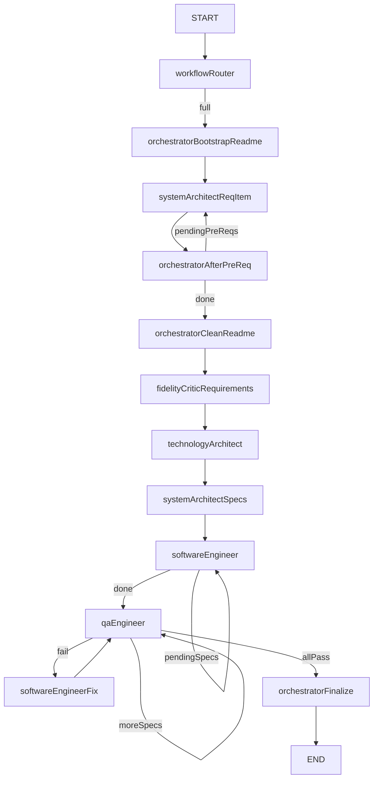

# Dev Team Orchestrator MCP

MCP server that runs a **spec-driven** LangGraph pipeline against 9router models:

1. System Architect → `README.md` + `.docs/requirements.md`
2. Technology Architect → `.docs/technologies.md`
3. System Architect → `.docs/todo.md` + `.docs/specs/*.spec.md`
4. Software Engineer → one spec at a time (or small punch-sized batch)
5. QA Engineer → vitest + fix loop with SE (bootstrap failures → bootstrapFix, not feature fix)
6. Finalize → README status + `.docs/pipeline-result.json` metrics

Greenfield (`full`/`feature`): **scaffold** (vite+vitest template) + `npm install` before SE.
MCP also exposes `get_pipeline_state` and `approve_gate` (HITL when `ZTEAM_HITL=1`).

## Setup

1. `cp .env.example .env` and fill in `NINEROUTER_BASE` / `NINEROUTER_KEY` (optional `MODEL_*`, `WORKSPACE_ROOT`, `GRAPH_RECURSION_LIMIT`, `MAX_QA_FIX_ROUNDS`, `PROGRESS_HEARTBEAT_MS`).
2. `npm install`
3. Register the MCP server in Cursor (`~/.cursor/mcp.json`) under the key **`zteam`**:

```json
{
  "mcpServers": {
    "zteam": {
      "command": "npx",
      "args": ["tsx", "C:/path/to/dev-team-orchestrator/src/orchestrator.ts"],
      "env": {
        "NODE_NO_WARNINGS": "1",
        "NINEROUTER_BASE": "https://your-9router-host/v1",
        "NINEROUTER_KEY": "sk-your-key"
      }
    }
  }
}
```

Cursor exposes the tool namespace as **`user-zteam`**. Restart MCP after changing the key.

## Cursor — `@zteam` / `/zteam`

| Trigger | What |
|---------|------|
| **`@zteam`** | Manual rule [`.cursor/rules/zteam.mdc`](.cursor/rules/zteam.mdc) in the mention picker |
| **`/zteam`** | Project skill [`.cursor/skills/zteam/SKILL.md`](.cursor/skills/zteam/SKILL.md) |
| Natural language (“roda o zteam…”) | Always-on rule [`.cursor/rules/dev-team-orchestrator.mdc`](.cursor/rules/dev-team-orchestrator.mdc) routes to the same MCP tool |

Always call `user-zteam.run_development_pipeline` (not Cursor Task subagents).

Examples:

```text
@zteam build a pac-man demo in samples/pacman
/zteam docs-only — plan a todo API in samples/todo-api
/zteam punch — make the submit button blue in samples/my-app
```

Pass `projectRoot` when you can. Optional `workflow`: `full` | `docs` | `feature` | `punch` | `fix` | `resume` (omit = auto-router).

Also see the always-on routing rule for stage/env details. Rescue mid-failure with `workflow=resume` (see skill).

## Modes / workflows

| Mode | How | Route |
|------|-----|--------|
| **auto** | omit `workflow` | `workflowRouter` classifies from idea + `.docs` on disk |
| **full** | `workflow=full` | bootstrap → SA pré-reqs\* → clean → fidelity → TA → specs → SE\* → QA\* → finalize |
| **docs** | `workflow=docs` or `docsOnly=true` / `--docs-only` | bootstrap → SA pré-reqs\* → clean → fidelity → TA → specs → finalize |
| **feature** | `workflow=feature` | specs → SE\* → QA\* → finalize |
| **punch** | `workflow=punch` | prepare → SE → QA → finalize |
| **fix** | `workflow=fix` | prepare → SE fix → QA → finalize |
| **resume** | `workflow=resume` | pending `[ ]` todos with specs → SE\* → QA\* → finalize |

Catalog + classifier: [`src/workflows/`](src/workflows/). Multiagent ideal (future): [`docs/adr-multiagent-flow.md`](docs/adr-multiagent-flow.md).

### Workflow `full`

Default greenfield path (`workflow=full`, or auto when there is no `.docs/requirements.md`):

1. **Bootstrap** — `README.md` with **Resume** (≤512 words) + numbered **Pré Requirements** (needs only, no tech); stub `.docs/requirements.md`
2. **SA loop** — for each pré-req: expand into a section of `.docs/requirements.md` (anchored to `userIdea` + Resume); notify progress
3. **Clean README** — keep only Resume + link to requirements
4. **Fidelity** — heuristic check vs `userIdea`; append Constraints if needed
5. **TA** → `.docs/technologies.md` (+ README)
6. **SA specs** → `.docs/todo.md` + `.docs/specs/*.spec.md`
7. **SE** → one pending spec at a time; `tsc` smoke before marking todo done; FILE paths sanitized
8. **QA** → SUMMARY and/or test FILEs; ensures `scripts.test` (vitest); smoke under `tests/smoke`; on bootstrap fail → **bootstrapFix**; on logic fail → **SE fix** → QA again
9. **Finalize** → README + `pipeline-result.json` (timings, retries, traceId, errorClass)
9. **Finalize** → README + `.docs/pipeline-result.json`



Hard guard: refuses to write when `projectRoot` is `.` and `appRoot` equals the orchestrator package (set `WORKSPACE_ROOT` and/or a dedicated `projectRoot`). `GRAPH_RECURSION_LIMIT` default **120**.

## Resilience (empty / invalid LLM)

- Empty/whitespace replies, missing `===FILE===`, empty file bodies, and failed docs section parses are **retryable** (up to 3 attempts, exponential backoff + short re-prompt).
- Network / 429 / 5xx are also retried.
- Docs stages (SA/TA/specs) may fall back or stub only **after** retries; SE/QA fail hard if content stays invalid.

## Live progress

While the pipeline runs (MCP tool or CLI):

- **stage** start/done with pending-spec hints
- **heartbeat** every ~30s of silence (`PROGRESS_HEARTBEAT_MS`, default `30000`) while waiting on LLM stream or `npm test`
- **partial** truncated preview after a heartbeat if stream text is interesting (`===FILE===` / section markers)
- MCP: `notifications/message` (logging) + `notifications/progress` when the client sends `progressToken`
- CLI: same lines on **stderr**; final `notifications[]` matches the live log

## CLI

```bash
npm run pipeline:docs -- --project-root samples/my-app "idea…"
npm run pipeline -- --workflow punch --project-root samples/my-app "só muda a cor do botão"
npm run pipeline -- --project-root samples/my-app "idea…"   # auto-classify
npm run pipeline:feature -- --project-root samples/my-app "add CSV export"
npm run pipeline:resume -- --project-root samples/my-app "resume pending"
npm run graph
npm run smoke
npm run smoke:workflows
npm run smoke:reqs
npm run smoke:files
npm run smoke:improvements
npm run smoke:architecture
npm run smoke:all
```

Use `projectRoot` so generated docs land in the app folder, not this MCP package.

### Smoke

- `npm run smoke` — retryable empty LLM + heartbeat
- `npm run smoke:workflows` — classifier heuristics
- `npm run smoke:reqs` — Resume / Pré Requirements parsers + safe appRoot guard
- `npm run smoke:files` — FILE sanitize, recursion helper, test preflight, fidelity heuristic
- `npm run smoke:improvements` — bootstrap/vitest/scaffold/FILE repair/progress close/healthcheck/metrics
- `npm run smoke:architecture` — architecture progress pack (pré-req hints, JSON artifact, summaries)
- CI: [`.github/workflows/zteam-smokes.yml`](.github/workflows/zteam-smokes.yml) runs `smoke:all`

Optional live check (needs 9router): run `npm run pipeline:docs -- --project-root samples/smoke-app "tiny idea"` and confirm heartbeats if a stage exceeds 30s.
