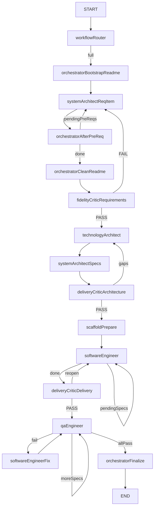

# Dev Team Orchestrator MCP

MCP server that runs a **spec-driven** LangGraph pipeline against 9router models:

1. System Architect → `README.md` + `.docs/requirements.md` (pré-reqs loop)
2. Fidelity critic → hard FAIL vs `userIdea` (redo SA) — no silent stub pass
3. Technology Architect → `.docs/technologies.md`
4. System Architect → `.docs/todo.md` + `.docs/specs/*.spec.md`
5. Delivery critic (architecture) → idea ↔ tech/specs gaps
6. Scaffold → vite+vitest template / augment missing shell files
7. Software Engineer → punch-sized **batch** of specs; `verifyDelivery` (Files to touch + `tsc`) before `markTodoDone`; redo with feedback
8. Delivery critic (delivery) → reopen incomplete slugs
9. QA Engineer → vitest + fix loop (bootstrap → bootstrapFix; logic → SE fix)
10. Finalize → README status + `.docs/pipeline-result.json` metrics

MCP also exposes `get_pipeline_state` and `approve_gate` (HITL when `ZTEAM_HITL=1`).

Package docs and pipeline graph live under **`.docs/`** (not `docs/`) — same convention as app artefacts (`.docs/requirements.md`, …).

## Setup

1. `cp .env.example .env` and fill in `NINEROUTER_BASE` / `NINEROUTER_KEY` (optional `MODEL_*`, `GRAPH_RECURSION_LIMIT`, `MAX_QA_FIX_ROUNDS`, `MAX_DELIVERY_FIX_ROUNDS`, `PROGRESS_HEARTBEAT_MS`).
2. `npm install`
3. Register the MCP server in Cursor (`~/.cursor/mcp.json`) under the key **`zteam`**:

```json
{
  "mcpServers": {
    "zteam": {
      "command": "npx",
      "args": ["tsx", "C:/path/to/dev-team-orchestrator/src/orchestrator.ts"],
      "env": {
        "NODE_NO_WARNINGS": "1",
        "NINEROUTER_BASE": "https://your-9router-host/v1",
        "NINEROUTER_KEY": "sk-your-key"
      }
    }
  }
}
```

**Do not** set a sticky `WORKSPACE_ROOT` in `mcp.json` — the skill passes `workspaceRoot` = the Cursor-open folder on every call (avoids writing into the wrong repo). Credentials stay in env; workspace is per-call.

Cursor exposes the tool namespace as **`user-zteam`**. Restart MCP after changing the key.

### Team models — `.zteam/config.json`

Models resolve as: `{app}/.zteam/config.json` → `{workspace}/.zteam/config.json` → env `MODEL_*` → built-in defaults.

The config gate opens when a config file exists **or** explicit `MODEL_*` env vars are set (`configGateSatisfied`). Otherwise the pipeline returns `failureKind=needsConfig` (CLI: `--skip-config-gate` for smoke).

Example:

```json
{
  "version": 1,
  "models": {
    "systemArchitect": "9RSA-system-architect-free",
    "technologyArchitect": "9RTA-technology-architect-free",
    "softwareEngineer": "9RSE-software-engineer-free",
    "qaEngineer": "9RQA-qa-free",
    "fallback": ""
  },
  "maxTokens": {
    "systemArchitect": 1600,
    "technologyArchitect": 2500,
    "softwareEngineer": 8000,
    "qaEngineer": 2000
  }
}
```

MCP tools: `get_zteam_config`, `write_zteam_config`, `run_development_pipeline`, `get_pipeline_state`, `approve_gate`.

### Env vars (orchestrator)

| Var | Role |
|-----|------|
| `NINEROUTER_BASE` / `NINEROUTER_KEY` | 9router OpenAI-compat endpoint |
| `ZTEAM_FORCE_BOOTSTRAP=1` | Force wipe of `.docs/requirements.md` on full/docs bootstrap (default: preserve if file has real `##` sections) |
| `ZTEAM_SE_BATCH` | SE batch size 1–3 (default **1**; workflow `punch` defaults to 3) |
| `MODEL_FALLBACK` / `*Fallback` per role | Local handoff after primary exhausts retries |
| `MODEL_SYSTEM_ARCHITECT_FALLBACK` etc. | Env override for per-role fallback |
| `MAX_DELIVERY_FIX_ROUNDS` | SE verify redo rounds (default 3) |

**After changing orchestrator source:** restart the MCP server `user-zteam` (no hot-reload). Confirm discovery lists config tools.

## Cursor — `@zteam` / `/zteam`

| Trigger | What |
|---------|------|
| **`@zteam`** | Manual rule [`.cursor/rules/zteam.mdc`](.cursor/rules/zteam.mdc) in the mention picker |
| **`/zteam`** | Project skill [`.cursor/skills/zteam/SKILL.md`](.cursor/skills/zteam/SKILL.md) |
| Natural language (“roda o zteam…”) | Always-on rule [`.cursor/rules/dev-team-orchestrator.mdc`](.cursor/rules/dev-team-orchestrator.mdc) routes to the same MCP tool |

Always call `user-zteam.run_development_pipeline` (not Cursor Task subagents).

Examples:

```text
@zteam build a pac-man demo in samples/pacman
/zteam docs-only — plan a todo API in samples/todo-api
/zteam punch — make the submit button blue in samples/my-app
```

Always pass `workspaceRoot` (absolute Cursor open folder) and `projectRoot` when you can. Optional `workflow`: `full` | `docs` | `feature` | `punch` | `fix` | `resume` (omit = auto-router).

Skill subcommands: **`@zteam/config`**, **`@zteam/models`**, **`@zteam/documentation`**, **`@zteam/tests`** — see [`.zteam/README.MD`](.zteam/README.MD).

Also see the always-on routing rule for stage/env details. Rescue mid-failure with `workflow=resume` (see skill). Resume reopens phantom `[x]` todos whose Files to touch are missing on disk.

## Modes / workflows

| Mode | How | Route |
|------|-----|--------|
| **auto** | omit `workflow` | `workflowRouter` classifies from idea + `.docs` on disk |
| **full** | `workflow=full` | bootstrap → SA pré-reqs\* → clean → fidelity → TA → specs → arch critic → scaffold → SE\* → delivery critic → QA\* → finalize |
| **docs** | `workflow=docs` or `docsOnly=true` / `--docs-only` | … → arch critic → finalize (no SE/QA) |
| **feature** | `workflow=feature` | specs → arch critic → scaffold → SE\* → … |
| **punch** | `workflow=punch` | prepare → SE → … |
| **fix** | `workflow=fix` | prepare → SE fix → QA → finalize |
| **resume** | `workflow=resume` | reopen phantoms + pending `[ ]` → scaffold → SE\* → QA\* |

Catalog + classifier: [`src/workflows/`](src/workflows/). Multiagent ideal (future): [`.docs/adr-multiagent-flow.md`](.docs/adr-multiagent-flow.md). Historical plans: [`.docs/postmortems/`](.docs/postmortems/).

### Workflow `full`

1. **Bootstrap** — Resume + Pré Requirements; stub `.docs/requirements.md` (empty LLM → `llm_empty`, no stub charter)
2. **SA loop** — expand each pré-req into `.docs/requirements.md`
3. **Clean README** — Resume + link to requirements
4. **Fidelity** — hard FAIL vs `userIdea` (API/locale/stub); one redo then classified abort
5. **TA** → `.docs/technologies.md`
6. **SA specs** → todo + `.docs/specs/*.spec.md`
7. **Architecture critic** — coverage gaps; may reopen TA
8. **Scaffold** — template or augment missing shell files + install
9. **SE** — batch specs; `verifyDelivery` (Files to touch + anti-batch-fake + `tsc`); redo with `deliveryFixRound` feedback; only then `markTodoDone`
10. **Delivery critic** — reopen incomplete slugs
11. **QA** — vitest; bootstrapFix vs SE fix by error class
12. **Finalize** → README + `.docs/pipeline-result.json` (timings, retries, `llmEmpty`, `specsMarkedWithoutFiles`, …)



Hard guard: refuses to write when `projectRoot` is `.` and `appRoot` equals the orchestrator package, or when a path escapes `workspaceRoot`. `GRAPH_RECURSION_LIMIT` default **120**.

## Resilience (empty / invalid LLM)

- Empty/whitespace replies, missing `===FILE===`, empty file bodies, and failed docs section parses are **retryable** (re-prompt + optional model fallback).
- After exhausted retries on docs/SE: **`failureKind=llm_empty`** — no silent TBD / implement-core stubs.
- Network / 429 / 5xx are also retried.
- Delivery verify FAIL → structured feedback + redo until `MAX_DELIVERY_FIX_ROUNDS`.

## Live progress

While the pipeline runs (MCP tool or CLI):

- **stage** start/done with pending-spec hints
- **heartbeat** every ~30s of silence (`PROGRESS_HEARTBEAT_MS`, default `30000`) while waiting on LLM stream or `npm test`
- **partial** truncated preview after a heartbeat if stream text is interesting (`===FILE===` / section markers)
- MCP: `notifications/message` (logging) + `notifications/progress` when the client sends `progressToken`
- CLI: same lines on **stderr**; final `notifications[]` matches the live log
- Pre-pipeline **healthcheck** on 9router/tunnel for `full`/`docs`/`feature` (&lt;30s fail-fast)

## CLI

```bash
npm run pipeline:docs -- --workspace-root C:/path/to/open/folder --project-root samples/my-app "idea…"
npm run pipeline -- --workflow punch --workspace-root C:/path/to/open/folder --project-root samples/my-app "só muda a cor do botão"
npm run pipeline -- --project-root samples/my-app "idea…"   # workspace from env/cwd; prefer --workspace-root
npm run pipeline:feature -- --project-root samples/my-app "add CSV export"
npm run pipeline:resume -- --project-root samples/my-app "resume pending"
npm run graph
npm run smoke
npm run smoke:workflows
npm run smoke:reqs
npm run smoke:files
npm run smoke:improvements
npm run smoke:architecture
npm run smoke:implementation
npm run smoke:zteam-config
npm run smoke:verify
npm run smoke:all
```

Use `--workspace-root` + `projectRoot` so generated docs land in the app folder, not this MCP package.

### Smoke

- `npm run smoke` — retryable empty LLM + heartbeat
- `npm run smoke:workflows` — classifier heuristics
- `npm run smoke:reqs` — Resume / Pré Requirements parsers + safe appRoot guard
- `npm run smoke:files` — FILE sanitize, recursion helper, test preflight, fidelity heuristic
- `npm run smoke:improvements` — bootstrap/vitest/scaffold/FILE repair/progress close/healthcheck/metrics
- `npm run smoke:architecture` — architecture progress pack
- `npm run smoke:implementation` — implementation progress pack
- `npm run smoke:zteam-config` — workspaceRoot override, `.zteam` merge, needsConfig, gitignore
- `npm run smoke:verify` — DoD / anti-batch / phantoms / architecture gaps / metrics
- CI: [`.github/workflows/zteam-smokes.yml`](.github/workflows/zteam-smokes.yml) runs `smoke:all`

Optional live check (needs 9router): run `npm run pipeline:docs -- --project-root samples/smoke-app "tiny idea"` and confirm heartbeats if a stage exceeds 30s.
