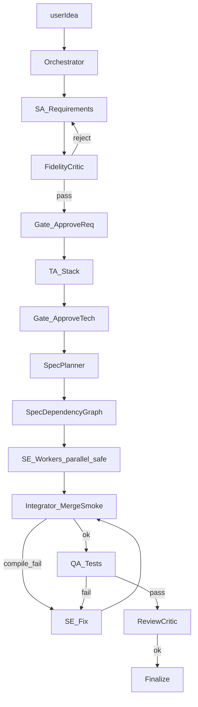

# ADR: fluxo multiagente ideal (zTeam)

**Status:** Proposed (design only — not fully implemented)  
**Date:** 2026-09-24  
**Context:** [`review.MD`](../review.MD) §8 — pipe linear frágil em greenfield.

## Decisão

Evoluir o orquestrador de uma cadeia SA→TA→SE→QA para um sistema com **critics, gates, grafo de specs (`dependsOn`), integrator e checkpoints** — **depois** da higiene P0–P2 do pipe atual.

Nesta entrega: apenas este ADR + schemas. Sem SE paralelo, sem HITL `approve_gate`.

## Fluxo-alvo



## Já no pipe atual (P0–P2)

| Ideal | Aproximação atual |
|-------|-------------------|
| FidelityCritic | nó `fidelityCriticRequirements` (heurística + Constraints append) |
| QaReport / FILE opcional | QA aceita `===SUMMARY===` |
| checkpoint / resume | `workflow=resume` + `.docs/pipeline-result.json` |
| smoke antes de done | `tsc --noEmit` pós-SE antes de `markTodoDone` |
| path hygiene | `sanitizeFilePath` / `sanitizeFileBody` |

## Schema — `.docs/pipeline-state.json` (futuro)

```json
{
  "version": 1,
  "workflow": "full",
  "appRoot": "/abs/path",
  "stage": "softwareEngineer",
  "pendingSpecs": ["maze-system"],
  "completedSpecs": ["project-setup"],
  "filesWritten": ["src/types.ts"],
  "gates": { "approveReq": "pending", "approveTech": "auto" },
  "updatedAt": "ISO-8601"
}
```

Escrita mínima pode espelhar `pipeline-result.json` em cada `timedStage` numa entrega futura.

## Schema — `dependsOn` no todo (futuro)

```markdown
- [ ] project-setup: Scaffold
- [ ] maze-system: Maze (dependsOn: project-setup, types-constants)
- [ ] entities: Ghosts (dependsOn: maze-system, state)
```

Parser sugerido: trailing `(dependsOn: slug, slug)`.

Paralelismo só quando **não** há overlap de paths nos specs da mesma wave.

## Papéis (resumo)

| Papel | Faz | Não faz |
|-------|-----|---------|
| Orchestrator | rota, budgets, checkpoints | código de produto |
| FidelityCritic | pass/reject vs userIdea | reescrever tudo |
| SpecPlanner | todo + specs + dependsOn | implementar |
| SE Worker | 1 spec + context pack | “melhorar” fora do escopo |
| Integrator | merge + tsc | redesign |
| QA | testes + QaReport | refatorar features |

## Anti-padrões

- Todo `[x]` sem smoke
- Paralelismo com overlap de arquivos
- Punch/fix reabrindo SA/TA sem necessidade
- Copiar projeto irmão sem registrar bypass

## Próximos passos de implementação

1. Writer de `pipeline-state.json` em `timedStage`
2. Parser `dependsOn` + waves seriais
3. Nó Integrator entre SE wave e QA
4. MCP `approve_gate` + interrupt LangGraph
