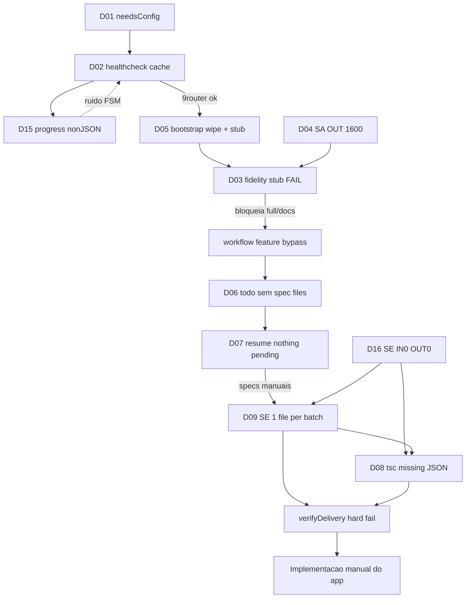

# zz-review — Defeitos do zteam (sessão MyPokeCards)

Análise minuciosa dos erros observados ao usar **@zteam** / MCP `user-zteam` para greenfield do app **MyPokeCards** (`C:\GIT\ZAPFCOORP\mypokecards`), em 2026-09-25/26.

**Fontes:** notificações MCP desta sessão; dumps de log [zz-mcp-user-zteam.md](zz-mcp-user-zteam.md), [zz-9router-logs.md](zz-9router-logs.md), [zz-mcp-logs.md](zz-mcp-logs.md); [`.docs/pipeline-result.json`](.docs/pipeline-result.json); [`.docs/architecture-progress.json`](.docs/architecture-progress.json); [`.docs/implementation-progress.json`](.docs/implementation-progress.json); código do orchestrator em `C:\Users\htzc\mcp-servers\dev-team-orchestrator\src\orchestrator.ts` e `verify-delivery.ts`; skills `.zteam/skills/SKILL.md` e `~/.cursor/skills/zteam-skill/SKILL.md`.

---

## 1. Resumo executivo

| Camada | Resultado |
|--------|-----------|
| Config / healthcheck | Falhou no 1º contato; recuperou após auth + config manual |
| Requirements (SA) | Conteúdo rico gerado, mas **fidelity hard-FAIL** bloqueou `full`/`docs` |
| Technologies / specs | Só avançaram via bypass `workflow=feature` + `technologies.md` manual |
| Scaffold | Aplicou shell mínimo + `npm install` |
| Software Engineer (modelos free) | Parcial: theme/i18n/api incompletos; lotes multi-spec com **1 arquivo**; respostas `IN 0 · OUT 0` no 9router |
| QA | Não chegou a rodar de forma útil no fechamento do produto |
| Entrega do app | **Concluída fora do SE**, alinhada aos artefatos `.docs/*` |
| Transporte MCP | Progresso texto plano → parse JSON do cliente (`transport_error`) em massa |

**Conclusão:** o zteam foi útil para **charter, requirements e checklist de specs**; o pipeline **não fechou** implementação end-to-end com os modelos free (`9RSE-software-engineer-free`). O principal bug de produto do orchestrator nesta sessão foi o **stub de bootstrap** que fazia o critic de fidelidade falhar mesmo com requirements preenchidos. O principal bloqueio de entrega foi o **SE under-delivery** (poucos `===FILE:===` por lote, às vezes resposta vazia) frente ao **verifyDelivery** rigoroso. Ruído adicional: progresso não-JSON no stdio (D15).

---

## 2. Linha do tempo

| Ordem | Workflow | `failureKind` | TraceId | Notas | Log ref |
|------:|----------|---------------|---------|-------|---------|
| 1 | `full` | `needsConfig` | — | Sem `.zteam/config.json`; tools `write_zteam_config` / `get_zteam_config` **não existem** no MCP | Fora dos dumps (notificação sessão); `injected env (0)` em zz-mcp-user-zteam L5 |
| 2 | `full` | `healthcheck` | `2acd79a9` | 9router abort ~5019ms | zz-mcp-user-zteam L11–13 |
| 3 | `full` (retry) | `healthcheck` | `e62aa1ea` | Mesmo erro **(cached)** em ~14ms | zz-mcp-user-zteam L16–17 |
| 4 | `full` (pós `mcp_auth`) | `fidelity` | `d9f95b13` | 15 pré-reqs; fidelity stub após ~632s | zz-mcp-user-zteam L192 |
| 5 | `docs` | `fidelity` | `bd16e94c` | 20–21 pré-reqs; stub persiste; bootstrap recomeçou | zz-mcp-user-zteam L378 |
| 6 | `feature` | `tsc` | `e868e5a1` | Specs 21; i18n sem JSONs; `empty` / `no_file_sections` | zz-mcp-user-zteam L410–459 |
| 7 | `resume` | _(ok vazio)_ | `794845d1` | “No pending `[ ]` specs with existing `.spec.md`” — só 4 specs no disco | Notificação sessão (sem `[pipeline] error` no dump) |
| 8 | `resume` | `spec_incomplete` | `a40fbf97` | storage-layer: Files-to-touch ambíguos | zz-mcp-user-zteam L508–511 |
| 9 | `resume` | `spec_incomplete` | `a4ceedc5` | search+card+deck: **batch 3 specs / 1 file** | zz-mcp-user-zteam L557–561 |

Estado final persistido em `.docs/pipeline-result.json`: `ok: false`, `failureKind: "spec_incomplete"`, `batchSize: 3`, `deliveryVerifyFails: 3`, `specsMarkedWithoutFiles: 6`.

---

## 3. Catálogo de defeitos

### D01 — Gate de config sem tools MCP de setup

| Campo | Detalhe |
|-------|---------|
| **Fase** | Config |
| **Severidade** | P1 |
| **Sintoma** | `failureKind=needsConfig`; `resumeHint`: chamar `write_zteam_config` |
| **Causa raiz** | Skill/README documentam `get_zteam_config` e `write_zteam_config`, mas o namespace MCP `user-zteam` só expõe `run_development_pipeline`, `get_pipeline_state`, `approve_gate`, `mcp_auth`. Sem `MODEL_*` no env do shell e sem `.zteam/config.json`, o gate falha. |
| **Evidência** | Resposta MCP `needsConfig: true`, `envModelsPresent: false` (notificação de sessão — **sem linha `needsConfig` nos três dumps**). Corroboração indireta: `◇ injected env (0) from .env` em [zz-mcp-user-zteam.md](zz-mcp-user-zteam.md) L5 / L25. `GetDynamicTools` sem tools de config. |
| **Mitigação** | Criação manual de [`.zteam/config.json`](.zteam/config.json) com defaults 9RSA/9RTA/9RSE/9RQA free |

### D02 — Healthcheck 9router falhou e ficou em cache

| Campo | Detalhe |
|-------|---------|
| **Fase** | Infra |
| **Severidade** | P0 (bloqueia qualquer pipeline) |
| **Sintoma** | `9router healthcheck failed in 5019ms: This operation was aborted`; retry: `(cached)` |
| **Causa raiz** | Timeout/abort na chamada ao tunnel 9router (`NINEROUTER_BASE` no `mcp.json`). Cache de falha impede retry imediato útil. Histórico: tunnel Cloudflare com **Origin DNS error 1016**. |
| **Evidência** | [zz-mcp-user-zteam.md](zz-mcp-user-zteam.md) L11–13: `[pipeline] error: 9router healthcheck failed in 5019ms: This operation was aborted trace=2acd79a9`; L16–17: mesmo erro `(cached) trace=e62aa1ea` / `MCP failed after 14ms`. Histórico [zz-mcp-logs.md](zz-mcp-logs.md) L29: createClient `user-zteam` error com HTML Cloudflare **Error 1016 Origin DNS** em `bedford-proceed-helmet-acceptance.trycloudflare.com` (2026-09-24). Depois `mcp_auth` + retry → `9router ok HTTP 200` (notificação sessão). |
| **Mitigação** | Reautenticar MCP / aguardar 9router saudável; não re-disparar em loop enquanto `(cached)` |

### D03 — Fidelity hard-FAIL por stub de bootstrap (bug do orchestrator)

| Campo | Detalhe |
|-------|---------|
| **Fase** | Requirements / fidelity |
| **Severidade** | P0 |
| **Sintoma** | Após 15–21 pré-reqs “feitos”, `fidelity FAIL: requirements empty or still bootstrap stub` |
| **Causa raiz** | Bootstrap grava sempre a linha `_Sections are filled one pré-requirement at a time._`. O SA **apenas anexa** seções `##`. O critic original falhava se a regex do stub casasse **em qualquer lugar** do arquivo, mesmo com conteúdo completo. |
| **Evidência** | [zz-mcp-user-zteam.md](zz-mcp-user-zteam.md) L192: `MCP failed after 632633ms (full): [fidelityCriticRequirements] fidelity FAIL after 2 round(s): requirements empty or still bootstrap stub trace=d9f95b13`. L378: `MCP failed after 611251ms (docs): … same … trace=bd16e94c`. Código bootstrap (`orchestrator.ts` ~L1843–1846); `architecture-progress.json` → `fidelity.ok: false`. |
| **Mitigação sessão** | Bypass com `workflow=feature` (pula bootstrap/fidelity). Patch local no orchestrator: strip do stub em `orchestratorCleanReadme` + fidelity só falha stub se **não** houver `##` sections (~L1681–1690, ~L2098–2107) — **exige restart do MCP** para valer |

### D04 — Truncamento / parse_failed no System Architect

| Campo | Detalhe |
|-------|---------|
| **Fase** | Requirements |
| **Severidade** | P1 |
| **Sintoma** | Seções cortadas mid-sentence; retries `parse_failed: expected a ## heading section`; latência SA >90s com warn de fallback |
| **Causa raiz** | Modelo SA free + **cap de saída ~1600 tokens** no 9router + conteúdo longo por pré-req (IN sobe ~15k→29k); respostas parciais / formato inválido ocasional |
| **Evidência** | [zz-mcp-user-zteam.md](zz-mcp-user-zteam.md) L90: heartbeat pré-req 7/15 `trace=d9f95b13`; L94: `LLM latency 99709ms > 90000ms — consider MODEL_*_FALLBACK`; L179: `parse_failed: expected a ## heading section` (`d9f95b13`); L361–363: `parse_failed` 1/3 e 2/3 (`bd16e94c`). [zz-9router-logs.md](zz-9router-logs.md): combo `9RSA-system-architect-free` → `nemotron-3-ultra-550b-a55b:free` com `OUT 1600` repetido (ex. L1, L6, L11, L16, L21, L26) enquanto `IN` cresce (15712→29285). |
| **Mitigação** | Completar/limpar `requirements.md` manualmente; evitar re-rodar `docs`/`full` (apaga arquivo — ver D05); aumentar maxTokens / chunkar |

### D05 — Bootstrap apaga requirements a cada full/docs

| Campo | Detalhe |
|-------|---------|
| **Fase** | Requirements |
| **Severidade** | P0 |
| **Sintoma** | Re-execução de `docs`/`full` descarta o `requirements.md` anterior e recomeça do stub |
| **Causa raiz** | `orchestratorBootstrapReadme` faz `writeDoc(REQUIREMENTS_PATH, stub)` incondicionalmente |
| **Evidência** | Código `orchestrator.ts` ~L1843–1846. Operacional nos logs: após `full` falhar em stub (`d9f95b13` L192), o run `docs` (`bd16e94c` L378) volta a falhar no **mesmo** sintoma stub — não há linha “wiping” no dump, mas a sequência de traces confirma reprocessamento do zero (20–21 pré-reqs regenerados na sessão). |
| **Mitigação** | Não re-rodar `full`/`docs` após requirements bons; preferir `feature`/`resume` |

### D06 — Specs declaradas no todo sem arquivos `.spec.md`

| Campo | Detalhe |
|-------|---------|
| **Fase** | Specs |
| **Severidade** | P0 |
| **Sintoma** | `todo.md` com ~21 slugs; disco com só 4 arquivos em `.docs/specs/` (project-setup, theme-system, i18n-ptbr, api-client) |
| **Causa raiz** | `systemArchitectSpecs` pode emitir `===TODO===` completo e falhar/parcializar emissão de todos os `===SPEC: slug===` (ou escrita incompleta), sem gate “todo ⊆ specs on disk” |
| **Evidência** | Glob pós-feature; notificação resume vazio `794845d1` (fora do dump como `[pipeline] error`). Nos dumps: progresso `resumePrep` ([zz-mcp-user-zteam.md](zz-mcp-user-zteam.md) L465+) e depois resumes com **17** / **16** specs pendentes (L485 `spec 1/17`, L526 `spec 1/16`) — confirma gap prévio e preenchimento parcial pós-specs manuais. |
| **Mitigação** | Specs manuais geradas para slugs faltantes; depois `resume` passou a enxergar 16–17 pendentes |

### D07 — Resume exige `.spec.md` existente para cada `[ ]`

| Campo | Detalhe |
|-------|---------|
| **Fase** | Resume |
| **Severidade** | P1 (comportamento documentável, mas péssimo UX) |
| **Sintoma** | `No pending [ ] specs with existing .spec.md — nothing to resume` apesar de muitos `[ ]` no todo |
| **Causa raiz** | `resumePrepare` só enfileira item se `pathExists(specPath(slug))` |
| **Evidência** | Trace `794845d1` e mensagem na notificação de sessão — **não aparece como `[pipeline] error` em** [zz-mcp-user-zteam.md](zz-mcp-user-zteam.md). Corroboração: tokens de progresso `[resumePrep…` (L465–467, L476–478) antes dos resumes que só andam após specs no disco. Lógica em `resumePrepareNode`. |
| **Mitigação** | Criar `.spec.md` antes de `resume`, ou regenerar specs via `feature` |

### D08 — i18n/api: tsc e arquivos JSON ausentes

| Campo | Detalhe |
|-------|---------|
| **Fase** | Implementação (SE) |
| **Severidade** | P0 |
| **Sintoma** | `VERIFY FAIL (tsc)`: não encontra `pt-BR.json`, `types.json`, `rarities.json`, etc.; “batch has 2 specs but only 1 file(s) written” |
| **Causa raiz** | SE emitiu `i18n.ts`/`i18n.tsx` com imports de JSON sem escrever os assets; lote `i18n-ptbr`+`api-client` incompleto; respostas LLM vazias/`no_file_sections` (ver D16) |
| **Evidência** | [zz-mcp-user-zteam.md](zz-mcp-user-zteam.md) L410: `empty: empty LLM response`; L426 / L440: `no_file_sections: no ===FILE:=== sections in response`; L454–459: `delivery verify exhausted (tsc): VERIFY FAIL for i18n-ptbr, api-client:` + `batch has 2 specs but only 1 file(s) written` + `TS2307: Cannot find module '../../data/translations/pt-BR.json'` (e `types.json`, `rarities.json`) `trace=e868e5a1`. 9router: SE `IN 0 · OUT 0` “succeeded” (ver D16). Histórico [zz-mcp-logs.md](zz-mcp-logs.md) L38: `retries exhausted (no_file_sections)` (2026-09-24). |
| **Mitigação** | JSON + `api/pokemontcg.ts` + `resolveJsonModule` manuais; marcar todos como `[x]` |

### D09 — Under-delivery do SE em lote (batchSize > 1)

| Campo | Detalhe |
|-------|---------|
| **Fase** | Implementação |
| **Severidade** | P0 |
| **Sintoma** | `batch has 3 specs but only 1 file(s) written — refuse fake completion`; 3 rounds → `delivery verify exhausted` |
| **Causa raiz** | Modelo SE free responde com poucas seções `===FILE:===` / `write_file`; verify exige cobertura dos **Files to touch** de **todas** as specs do batch (`batchSize: 3` no resultado final) |
| **Evidência** | [zz-mcp-user-zteam.md](zz-mcp-user-zteam.md) L557–561: `MCP failed after 243358ms (resume): … delivery verify exhausted (spec_incomplete): VERIFY FAIL for search-feature, card-detail, deck-crud:` + `batch has 3 specs but only 1 file(s) written` + missing `SearchPage.tsx`, `CardGrid.tsx`, `SearchFilters.tsx`, `CardDetail.tsx`, `CardDetailSheet.tsx`, `DecksPage.tsx`, `DeckEditor.tsx` `trace=a4ceedc5`. Heartbeats L526/L536/L546. `implementation-progress.json` → `lastWrite.count: 1`; `pipeline-result.json`. |
| **Mitigação** | Implementação manual das features restantes; reduzir batch / modelos melhores (recomendação) |

### D10 — Coerção indevida `.ts` → `.tsx`

| Campo | Detalhe |
|-------|---------|
| **Fase** | Implementação / write pipeline |
| **Severidade** | P2 |
| **Sintoma** | `coerced src/.../types.ts → types.tsx` / `deckStore.ts → deckStore.tsx` |
| **Causa raiz** | Heurística `writeParsedFiles` trata conteúdo como JSX e força extensão tsx mesmo em módulos de tipos/store |
| **Evidência** | Texto literal `coerced …ts → …tsx` **não aparece** nos três dumps. Nos dumps só progresso truncado `[writeParse…` em [zz-mcp-user-zteam.md](zz-mcp-user-zteam.md) L400, L414, L444, L489, L496, L502, L530, L540 (traces `e868e5a1`, `a40fbf97`, `a4ceedc5`). Coerção observada nas **notificações MCP da sessão**. |
| **Mitigação** | Remover `.tsx` espúrios; manter `.ts` para lógica sem JSX |

### D11 — Specs manuais com paths ambíguos quebram verify

| Campo | Detalhe |
|-------|---------|
| **Fase** | Specs / verify (interação humano + tooling) |
| **Severidade** | P1 |
| **Sintoma** | `missing Files to touch: src/features/storage-layer/\` (or closest feature folder)...` |
| **Causa raiz** | Specs geradas com bullets tipo `` `src/features/x/` (or closest...) ``. `parseFilesToTouch` em `verify-delivery.ts` interpreta a linha quase literalmente após strip parcial de backticks |
| **Evidência** | [zz-mcp-user-zteam.md](zz-mcp-user-zteam.md) L508–510: `VERIFY FAIL for storage-layer:` + `missing Files to touch: src/features/storage-layer/\` (or closest feature folder), src/App.tsx\` / routes as needed, src/shared/\` helpers when shared` `trace=a40fbf97`. Código `parseFilesToTouch` ~L63–92. |
| **Mitigação** | Reescrever specs com paths absolutos limpos (`src/shared/storage/db.ts`, etc.) |

### D12 — Phantom done: project-setup `[x]` sem stack prometida

| Campo | Detalhe |
|-------|---------|
| **Fase** | Scaffold / todo |
| **Severidade** | P1 |
| **Sintoma** | `project-setup` marcado feito; `package.json` só com React; App = `Hello`; sem Tailwind/Router/Zustand até instalação manual |
| **Causa raiz** | Scaffold mínimo do orchestrator ≠ critérios do spec `project-setup`; mark-done sem verificar Files to touch / deps |
| **Evidência** | **Fora destes dumps** — evidência em artefatos do repo (spec project-setup vs `package.json` pré-fix; `App.tsx` inicial). Nos logs: progresso `[scaffoldPr…` ([zz-mcp-user-zteam.md](zz-mcp-user-zteam.md) L393–395, L479–481) e heartbeat `QA 1/21: project-setup` (L406) sem falha dedicada de deps. |
| **Mitigação** | `npm install react-router-dom zustand idb` + Tailwind; app shell real |

### D13 — Divergência skill ↔ schema MCP

| Campo | Detalhe |
|-------|---------|
| **Fase** | Tooling / DX |
| **Severidade** | P2 |
| **Sintoma** | Skill exige `workspaceRoot` absoluto; schema listado de `run_development_pipeline` só documenta `userIdea`, `projectRoot`, `workflow`, `docsOnly` |
| **Causa raiz** | Documentação da skill à frente (ou dessincronizada) das tools publicadas no descriptor MCP |
| **Evidência** | **Sem evidência direta nos três dumps.** `GetDynamicTools` vs `.zteam/skills/SKILL.md` (sessão); na prática `workspaceRoot` **foi aceito** como arg extra. |
| **Mitigação** | Passar `workspaceRoot` mesmo assim; alinhar schema MCP à skill |

### D14 — Processos orchestrator zumbis / sem hot-reload

| Campo | Detalhe |
|-------|---------|
| **Fase** | Operacional |
| **Severidade** | P1 |
| **Sintoma** | Vários `npx tsx ... orchestrator.ts` ativos (datas diferentes); patch de fidelity no fonte não afeta sessão até restart |
| **Causa raiz** | Cursor mantém MCP long-running; `tsx` carrega código na subida |
| **Evidência** | Listagem de processos Node com `orchestrator.ts` nesta sessão. Nos dumps: reconnects `stopped connection` / `connecting stdio` ([zz-mcp-user-zteam.md](zz-mcp-user-zteam.md) L1–8, L20–28) + `connection:transport_error` (L10, L30) — processo MCP reinicia sem hot-reload do código patchado. |
| **Mitigação** | Reiniciar servidor MCP zteam após mudanças no orchestrator |

### D15 — Progresso do orchestrator não-JSON quebra o cliente MCP

| Campo | Detalhe |
|-------|---------|
| **Fase** | Transporte MCP / DX |
| **Severidade** | P1 (ruído + FSM `failed`; pipeline às vezes continua) |
| **Sintoma** | Centenas de `Client error: Unexpected token '…', "[pipeline|workflowRo|orchestrat|systemArch|softwareEn|fidelityCri|writeParse|resumePrep|scaffoldPr|…] … is not valid JSON"`; `connection:transport_error: conn=connected → conn=failed` |
| **Causa raiz** | Orchestrator emite progresso/status em **texto plano** no stdio (`[pipeline] …`, `[systemArchitect…] …`). O cliente MCP do Cursor interpreta a linha como JSON-RPC e falha o parse. |
| **Evidência** | [zz-mcp-user-zteam.md](zz-mcp-user-zteam.md) L9–10 (primeiro `Unexpected token 'p', "[pipeline]"` + `transport_error`); padrão repetido em quase todo o arquivo (ex. L32–35, L174–176, L400, L465). Também `No number after minus sign in JSON` ao ecoar bullets `- batch has…` (L449–450, L505–506, L552–554). [zz-mcp-logs.md](zz-mcp-logs.md) L29/L38: `Received a progress notification for an unknown token` com `message` contendo HTML/erro de pipeline. |
| **Mitigação** | Emitir progress via MCP `notifications/progress` / logging estruturado, **não** stdout/stderr texto livre misturado ao protocolo |

### D16 — 9router marca sucesso com resposta vazia (`IN 0 · OUT 0`)

| Campo | Detalhe |
|-------|---------|
| **Fase** | Infra LLM / SE |
| **Severidade** | P0 (alimenta D08/D09) |
| **Sintoma** | Combo SE reporta `Model … succeeded` com `DONE … IN 0 · OUT 0` (latência ~97–99s); orchestrator em seguida faz retry `empty` / `no_file_sections` |
| **Causa raiz** | Provider/combo `oc/muse-spark-1.3-contributor-free` (via `9RSE-software-engineer-free`) devolve stream “sucesso” sem tokens; 9router não propaga falha ao caller |
| **Evidência** | [zz-9router-logs.md](zz-9router-logs.md) L70–71: `DONE 97670ms · IN 0 · OUT 0` + `Model oc/muse-spark-1.3-contributor-free succeeded`; L80–81: `DONE 99874ms · IN 0 · OUT 0` + succeeded. Correlação temporal com [zz-mcp-user-zteam.md](zz-mcp-user-zteam.md) L410 (`empty LLM response`) e L426/L440 (`no_file_sections`) no `trace=e868e5a1`. |
| **Mitigação** | Tratar `IN=0/OUT=0` como falha no 9router ou no client LLM do orchestrator; forçar fallback de modelo; `batchSize: 1` |

---

## 4. Matriz causa → efeito



---

## 5. Lacunas de tooling MCP

| Esperado (skill / README) | Presente no MCP `user-zteam` |
|---------------------------|------------------------------|
| `get_zteam_config` | **Não** |
| `write_zteam_config` | **Não** |
| `run_development_pipeline` | Sim |
| `get_pipeline_state` | Sim |
| `approve_gate` | Sim |
| `mcp_auth` | Sim |

Impacto: setup obrigatório vira edição manual de JSON; a mensagem de erro aponta uma tool que o agent não consegue chamar.

Modelos usados nesta sessão (após config): `9RSA-system-architect-free`, `9RTA-technology-architect-free`, `9RSE-software-engineer-free`, `9RQA-qa-free`.

No 9router (dump): SA → `openrouter/nvidia/nemotron-3-ultra-550b-a55b:free`; SE → `opencode/muse-spark-1.3-contributor-free`.

---

## 6. Recomendações (orchestrator / playbook)

### P0 — Orchestrator

1. **Não falhar fidelity só pela presença do stub** se já existirem headings `##` (patch local parcial já existe — publicar + reiniciar MCP).
2. **Remover o stub em `orchestratorCleanReadme`** (já no fonte local ~L2098–2107).
3. **Não apagar `requirements.md` no bootstrap** se o arquivo já tiver seções reais (ou exigir flag `forceBootstrap`).
4. **Gate pós-specs:** `todo` slugs ⊆ arquivos em `.docs/specs/*.spec.md` antes de SE.
5. **SE batch:** `batchSize: 1` para modelos free, ou falhar cedo se `filesWritten.length < expected`.
6. **Não marcar todo `[x]`** sem `verifyDelivery` + `tsc` (e, para project-setup, `package.json` deps mínimas).
7. **Tratar resposta LLM vazia** (`IN 0 · OUT 0` / `empty`) como falha imediata + fallback de modelo (D16).

### P1 — DX / skill

8. Expor `get_zteam_config` / `write_zteam_config` no MCP **ou** atualizar skill para “escreva `.zteam/config.json` manualmente”.
9. Documentar `workspaceRoot` no schema da tool.
10. Healthcheck: TTL curto no cache de falha; mensagem clara “reinicie MCP / verifique tunnel”.
11. Specs: validar “Files to touch” como paths relativos limpos (rejeitar prosa).
12. **Progresso MCP:** emitir via notifications/logging estruturado, **não** stdout texto livre misturado ao JSON-RPC (D15).

### P2 — Qualidade LLM

13. Aumentar `maxTokens` do SA (hoje ~`OUT 1600` no 9router) ou chunkar melhor para evitar truncamento.
14. Coerção `.ts`→`.tsx` só se AST/JSX real, não heurística frouxa.

### Playbook operador (já validado nesta sessão)

```text
1. Garantir .zteam/config.json + 9router saudável
2. Evitar re-rodar full/docs após requirements bons
3. Se fidelity stub → feature (com technologies.md) ou patch+restart MCP
4. Antes de resume: garantir .spec.md por cada [ ]
5. Se SE free sob batch incompleto / IN0 OUT0 → completar arquivos / batch=1 / modelo melhor
6. Após patch no orchestrator: reiniciar MCP (sem hot-reload)
```

---

## 7. O que o zteam entregou de valor

- Charter e lista longa de pré-requisitos alinhados à ideia MyPokeCards
- `requirements.md` substancial (após limpeza)
- Checklist de 21 specs / slugs de domínio
- Scaffold Vite+React inicial + tema parcial + esboço i18n/api
- Métricas e `pipeline-result.json` rastreáveis por `traceId`

---

## 8. Referência rápida de traces / logs

| TraceId / sinal | Papel | Onde |
|-----------------|--------|------|
| `2acd79a9` | Healthcheck abort | zz-mcp-user-zteam L11–13 |
| `e62aa1ea` | Healthcheck cached | zz-mcp-user-zteam L16–17 |
| `d9f95b13` | Full → fidelity stub (15 pré-reqs); latency/parse | zz-mcp-user-zteam L94, L179, L192 |
| `bd16e94c` | Docs → fidelity stub; parse_failed 2× | zz-mcp-user-zteam L361–378 |
| `e868e5a1` | Feature → empty / no_file_sections / tsc | zz-mcp-user-zteam L410–459 |
| `794845d1` | Resume vazio (sem spec files) | notificação sessão (fora dump) |
| `a40fbf97` | Resume → storage-layer paths ruins | zz-mcp-user-zteam L508–511 |
| `a4ceedc5` | Resume → batch 3 / 1 file | zz-mcp-user-zteam L557–561 |
| `OUT 1600` (SA) | Cap de tokens → truncamento (D04) | zz-9router-logs (várias linhas) |
| `IN 0 · OUT 0` (SE) | Sucesso falso vazio (D16) | zz-9router-logs L70, L80 |
| Cloudflare 1016 | Tunnel DNS morto (contexto D02) | zz-mcp-logs L29 |
| `Unexpected token … not valid JSON` | Progresso não-JSON (D15) | zz-mcp-user-zteam (em massa) |

---

*Documento gerado para análise pós-mortem da sessão MyPokeCards + zteam. Atualizado com evidências literais dos dumps `zz-*-logs.md`. Não altera o pipeline; recomendações são propostas de correção.*
